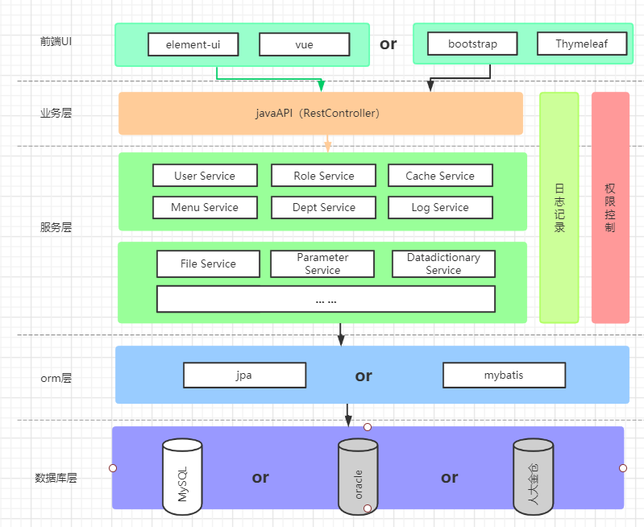

## 整体架构
Diamond是前后端分离架构，后端提供Http接口、前端是基于VUE体系的SPA单页应用

### 工程结构
1. diamond-app-backend-sample:模拟实际使用Diamond框架的项目示例
1. diamond-app-doc: 文档源码
1. diamond-app-frontend-vue: 前端源码
1. diamond-common: 公共模块
1. diamond-common-mybatis: 公共模块
1. diamond-log : log模块
1. diamond-log-mybatis: log模块
1. diamond-security: 安全模块
1. diamond-security-jwt: 安全模块
1. diamond-sys: 内置系统管理业务模块
1. diamond-sys-mybatis: 内置系统管理业务模块
1. diamond-sys-web: 内置系统管理业务模块

### 前后端分离
* 前端技术栈
    * 依赖框架：Node、VUE、HTML5、CSS、Jquery、Thymeleaf、Bootstrap等
    * 开发工具：不限制，如vs/web storm/eclipse/idea等
    * 构建工具：npm,webpack
    * 代码管理工具：git
* 后端技术栈
    * 依赖框架：Spring Boot
    * 开发工具：不限制，如sts/eclipse/idea等
    * 插件：lombok
    * 构建工具：maven（推荐使用3.6.0以上版本）
    * 代码管理工具：git
    * 数据库：mysql、oracle、人大金仓（推荐mysql8）、PgSql等

## 业务功能
整体从实现的业务功能来看，Diamond 实现了基础的业务功能：  

 

