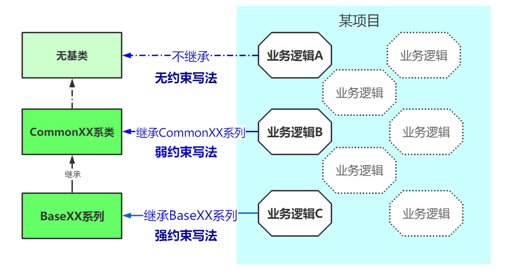

## 使用Diamond Common提高后端开发效率
Diamond Common是Diamond框架的核心。Diamond Common主要功能有：
* 抽象出各个层的CommonXX和BaseXX系列基类。对单独业务表、关联表、Tree型业务表等基础的CRUD、分页查询等进行了抽象和封装。
* 定义了PageDTO、ResultDTO系列数据结构，对常用数据的类型、命名等统一规范。
* 定义CommonException、CommonExceptionHandler等异常基类和统一异常处理器，对异常处理统一规范。
* 其他：如缓存Cache处理规范、统一validator参数校验逻辑、一些简单工具类等等

使用Diamond Common可以极大地提高开发效率、减少bug。这是很多设计细节综合起来后表现出的整体效果, 例如：
1. CommonXX和BaseXX系列基类
    1. 使得开发者不用再写重复性的简单CRUD，只需要专注在复杂的业务逻辑代码
    1. 强制性约束规范，使得不同水平的开发者可以写出统一风格的、安全稳定的代码
    1. 口头约束规范：通过约束大于配置的思想，减少开发者不必要的代码量
    1. 其他,如所有实体表都是逻辑删除等等
2. 统一常用的数据结构
   1. PageDTO统一分页查询和返回参数
   1. ResultDTO统一API接口返回参数
   1. CommonUserDTO统一用户基础属性
   1. 其他
3. 统一异常
   1. 每个方法中只需要return正确的对象，遇到异常逻辑直接throw异常，开发者不需要再写很多try catch
   1. 同理，不用再return各个异常逻辑对象，避免不必要的if else等代码逻辑
   1. 统一定义异常返回code值和具体异常描述信息，使得开发者不再纠结异常描述不清晰、异常国际化、异常前端展示不友好等等一系列问题
4. 统一参数校验
   1. 开发者不用在每个方法开始增加参数校验逻辑，只需要在DTO对象中配置校验注解
   2. 灵活的校验扩展方式，使得开发者可以专注写正确情况下的业务逻辑，减少思虑不周造成代码出错的概率。
5. Diamond Common模块本身非常精简、轻量级、无侵入设计，没有额外负担
   1. 精简的代码风格
   2. 不使用@Component、@Service、@Controller、@Bean等等注解预置声明对象，因此不会对系统进行任何侵入。
6. 其他，如统一的缓存生命周期管理，常用简单工具类等等都对提高开发效率和程序稳定性有很大帮助

### 引用方式
maven引用：
```xml
<dependency>
    <groupId>com.hoioy.diamond</groupId>
    <artifactId>diamond-common-jpa</artifactId>
    <version>{版本号}</version>
</dependency>
```

gradle引用：
```
implementation("com.hoioy.diamond:diamond-common-jpa:{版本号}")
```

### CommonXX和BaseXX系列基类
`Diamond Common`是`Diamond框架`的核心，那么`CommonXX和BaseXX系列基类`是`Diamond Common`的核心, 
因此在本文中将大篇幅介绍`CommonXX和BaseXX系列基类`。

CommonXX系列做了基础的逻辑抽象和封装。BaseXX系列继承了CommonXX系列，在CommonXX系列的基础上又增加了更多功能和规范。  

在使用Diamond Common开发业务逻辑时，可以选择继承 BaseXX系列，也可以直接继承 CommonXX系列，也可以不继承而直接用原始Spring Boot写法。
因此，基于Diamond框架开发的项目可以同时使用三种写法，我们称为：
1. 强约束写法：业务逻辑继承自BaseXX系列
1. 弱约束写法: 业务逻辑继承自CommonXX系列
1. 无约束写法: 不继承Diamond任何类


对于自主可控程度高的业务逻辑，我们强烈建议使用强约束写法。
尽量使用强约束写法来提高效率和稳定性，其次弱约束写法，最后没有选择的时候再使用无约束写法。

我们通过模拟一个学生管理相关项目示例来介绍Diamond Common开发。具体代码参考diamond-app-backend-sample工程。学生管理项目简单业务如下：

|实体（表）|业务描述|分析|计划使用的写法|
|---|---|----|---------|
|Student|学生实体表|普通单表|强约束写法：继承BaseXX系列|
|Course|课程实体表|普通单表|强约束写法：继承BaseXX系列|
|CourseStudentScore|学生和课程关联表、成绩|关联表|强约束写法：继承BaseJoinXX系列|
|SchoolGrade|学校年级实体表|树型单表|强约束写法：继承BaseTreeXX系列|
|Room|教室实体表|普通单表|弱约束写法：继承CommonXX系列|
|Teacher|老师实体表|普通单表|无约束写法：不继承|
