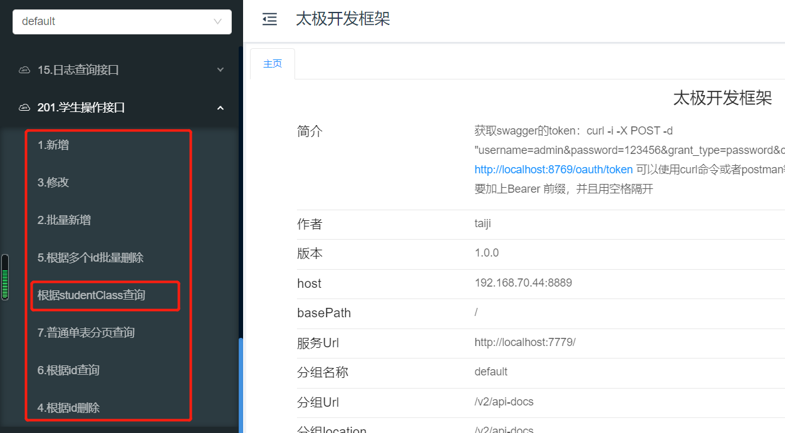
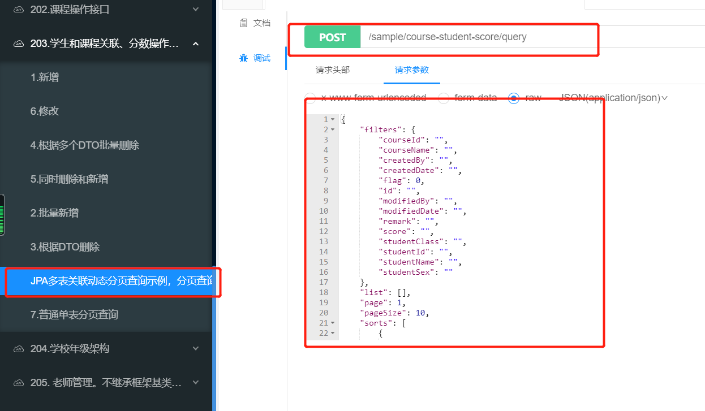
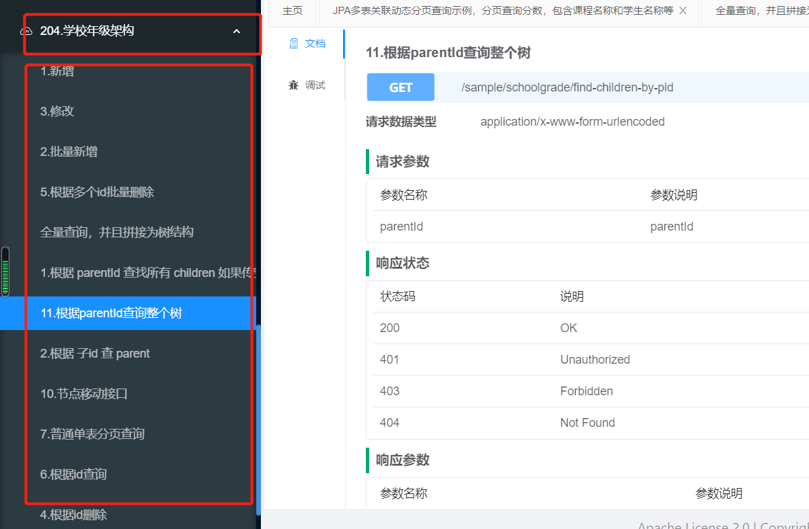

### 强约束写法
强约束是指定义了一些开发规范和最佳实践，使得开发者开发时候有一种“约束感”，开发者必须“遵纪守法”，使得不同水平开发者可以写出基本风格一致的代码。
强约束写法本身面向扩展进行设计，可以灵活扩展。

* 继承BaseXX系列实现单表业务逻辑
* 继承BaseJoinXX系列实现关联表逻辑
* 继承BaseTreeXX系列实现Tree型表逻辑

### 继承BaseXX系列实现单表业务逻辑
继承BaseXX系列的写法完成Student业务逻辑。
将代码逻辑分为三层：
* 持久层：或称为Dao层、Repository层等等，写数据库交互逻辑，代码量很少
* 业务层：或称Service层等，写实际业务逻辑，大部分代码都在这一层
* 接口层：或称Controller层、Web层、API层等等，对外暴露Http等接口，写参数校验、参数数据格式转换等逻辑，代码量很少

#### 1.持久层定义领域对象
首先需要定义Student都有哪些属性、与其他实体有什么关系，也就是首先定义领域对象。

```java
@Data
@NoArgsConstructor
@Entity
@Table(name = "student")
@Where(clause = "flag=1")
public class Student extends BaseDomain {
    private static final long serialVersionUID = 7578292815543449813L;

    @CommonJpaQueryWord(func = CommonJpaQueryWord.MatchType.like)
    private String studentName;

    @CommonJpaQueryWord(func = CommonJpaQueryWord.MatchType.equal)
    private String studentSex;

    @CommonJpaQueryWord(func = CommonJpaQueryWord.MatchType.like)
    private String studentClass;
}
```
1. 继承BaseDomain，BaseDomain中定义基础属性如id表示主键，createdBy表示创建者，createdDate表示创建时间，
flag是否删除标志等等多个预置属性，这是定义数据结构规范的一部分。如果具体项目想要自定义属性名，比如使用其他属性名称createdTime来表示createdDate，
则可以使用@AttributeOverride进行重命名。
1. 定义Student自己的业务属性studentName表示名称、studentSex表示性别、studentClass表示班级。
1. @CommonJpaQueryWord(func = CommonJpaQueryWord.MatchType.like)注解表示在分页查询时此属性支持like过滤。
1. @Data和@NoArgsConstructor是lombok注解，表示编译时会自动生成属性的getter、setter方法和无参构造函数。
1. @Entity是JPA注解，声明数据库实体类
1. @Table(name = "student")是JPA注解，定义映射到数据库的表名称
1. @Where(clause = "flag=1")是JPA注解，表示所有查询条件都拼接上flag=1。Diamond所有实体表（主表）业务逻辑都使用逻辑删除，flag=0表示此数据已经删除，所以查询数据
时候需要拼接flag=1的查询条件

#### 2.持久层声明Repository
有了领域对象，需要定义具体与数据库交互的方法。
```java
public interface StudentRepository extends IBaseRepository<Student> {
    List<Student> findByStudentClass(@Param("studentClass") String studentClass);
}
```
1. 强约束写法需要继承IBaseRepository，泛型为Student。IBaseRepository本身继承了JpaRepository,JpaSpecificationExecutor等等
1. 这里仅仅定义了一个findByStudentClass方法。因为JPA本身预置了很多基础的CRUD方法

#### 3.定义数据转换对象DTO
Domain代表数据库实体，我们经常不会直接返回Domain到前端，而是对Domain进行数据格式的加工处理后再返回到前端，这时候需要定义对应的数据转换
对象。
```java
@ApiModel(value = "Student对象")
@Data
@NoArgsConstructor
public class StudentDTO extends BaseDTO {
    private static final long serialVersionUID = 2558887945428876699L;

    @Size(min = 2, max = 20, message = "学生姓名长度只能在2-20之间")
    private String studentName;

    private String studentSex;

    @Size(min = 2, max = 20, message = "学生班级长度只能在2-20之间")
    private String studentClass;
}
```
1. 继承 BaseDTO，BaseDTO本身也预置了与BaseDomain对应的属性
1. 声明与BaseDomain对应的studentName、studentSex、studentClass属性。如果根据业务需求，DTO属性与Domain属性不一致，在Service层写好DTO与Domain的属性映射就可以了。
1. @ApiModel是swagger注解。
1. @Size是Spring Validator的注解，用于参数校验

#### 4.业务层定义Service
Domain和DTO数据对象、数据库交互逻辑Repository都准备好以后，就可以专注在实现具体业务逻辑了。
首先声明业务逻辑接口：
```java
public interface IStudentService extends IBaseService<StudentDTO, Student> {
    List<StudentDTO> findByStudentClass(String studentClass);
}
```
1. 继承IBaseService，泛型传对应的DTO与Domain
1. 这里仅仅定义了一个findByStudentClass方法。因为IBaseService本身预置了很多基础的CRUD方法

其次定义业务逻辑具体实现：
```java
@Service
public class StudentServiceImpl extends BaseServiceImpl<StudentRepository, Student, StudentDTO> implements IStudentService {

    @Override
    public StudentDTO beforeCreate(StudentDTO dto) {
        if (StrUtil.isEmpty(dto.getStudentClass())) {
            throw new CommonException("学生班级不能为空");
        }
        if (StrUtil.isEmpty(dto.getStudentName())) {
            throw new CommonException("学生姓名不能为空");
        }
        if (StrUtil.isEmpty(dto.getStudentSex())) {
            throw new CommonException("学生性别不能为空");
        }
        return super.beforeCreate(dto);
    }

    @Override
    public List<StudentDTO> findByStudentClass(String studentClass) {
        List<Student> students = iBaseRepository.findByStudentClass(studentClass);
        return domainListToDTOList(students);
    }
}

```
1. 继承 BaseServiceImpl，泛型传对应的Repository、DTO、Domain。BaseServiceImpl内置了基础的CRUD、分页查询等实现。
1. 实现 IStudentService 接口
1. @Service是Spring基础注解，表示这是一个Service。
1. 这里重写了 beforeCreate 方法，BaseServiceImpl提供很强的扩展性，beforeCreate表示在执行真正Create操作前处理一些其他逻辑。如果BaseServiceImpl默认
的逻辑不满足需求，子类可以基于面向对象的重载和重写技术进行扩展。注意调用super的时机。
1. 这里对findByStudentClass进行了实现。domainListToDTOList是BaseServiceImpl内置的Domain和DTO互相映射的方法。类似的domainToDTO、dtoToDomain等等预置
方法都可以被子类重写，使用自定义映射逻辑

#### 5.接口层定义Controller
业务逻辑完成后，就可以写API接口，对外暴露功能了。
```java
@RestController
@Api(tags = {"201.学生操作接口"})
@RequestMapping("/sample/student")
public class StudentController extends BaseController<IStudentService, StudentDTO> {
    @ApiOperation(value = "根据studentClass查询")
    @GetMapping(value = "/findByStudentClass")
    public ResultDTO findByStudentClass(@RequestParam String studentClass) {
        log.debug("into findByStudentClass");
        List<StudentDTO> data = iBaseService.findByStudentClass(studentClass);
        return new ResultDTO(data);
    }
}
```
1. 继承BaseController，泛型传递对应的Service和DTO。
1. 只实现findByStudentClass接口。因为BaseController中预置了基础的CRUD、分页等接口。
1. @RestController 是SpingBoot的基础注解，表示Rest API接口
1. @RequestMapping 是SpingBoot的基础注解，定义URL映射路径
1. ResultDTO是统一返回到前端的数据对象

#### 6.使用Swagger测试接口
Student业务逻辑代码全部完成以后，可以运行项目，使用Swagger接口进行测试。


1. 自动包含了基础的CRUD和分页接口
1. 包含了自定义的`根据studentClass查询`接口

#### 7.小练习
参考Student业务逻辑代码，实现Course业务逻辑

### 继承BaseJoinXX系列实现关联表逻辑
在实际项目中，多表关联查询、多表一致性增删改的业务场景才是常规的场景。基于JPA可以快速实现关联表业务逻辑，同时Diamond也提供
了更为简单的继承BaseJoinXX系列的写法。
CourseStudentScore 业务逻辑：CourseStudentScore顾名思义，是学生和课程关联表的多对多关联表，除了ID类属性，
还包含了一个业务属性：成绩score。

#### 1.持久层定义领域对象
首先定义领域对象 CourseStudentScore ：

```java
/**
 * 学生和课程关联表，附带成绩
 **/
@Data
@NoArgsConstructor
@Entity
@Table(name = "CourseStudentScore")
public class CourseStudentScore extends BaseJoinDomain {
    private static final long serialVersionUID = 7578292815541249813L;

    @BaseJoinId(index=BaseJoinId.Index.first)
    private String studentId;

    @BaseJoinId(index=BaseJoinId.Index.second)
    private String courseId;

    @CommonJpaQueryWord(func = CommonJpaQueryWord.MatchType.like)
    private String score;
}
```

1. 继承 BaseJoinDomain，BaseJoinDomain 是所有关联表类型的基类，定义基础属性id表示主键
1. @BaseJoinId 注解也是Diamond的自定义注解，用来标志这个字段是ID类字段，BaseJoinId.Index.first用来表示关联表ID的排序，
如果是5个表的关联表，那么每个表的ID字段注解BaseJoinId.Index.first、second...Fifth依次排序，不可以重复。
1. score属性是一个业务字段，表示某个学生某个课程的成绩。

#### 2.持久层声明Repository
关联表有了领域对象，需要定义具体与数据库交互的方法。
```java
@Repository
public interface CourseStudentScoreRepository extends IBaseJoinRepository<CourseStudentScore> {
    String findScoreWithNamesPageableJPQL = " from CourseStudentScore t " +
            " left join Student s on t.studentId=s.id " +
            " left join Course c on t.courseId=c.id " +
            " where (:#{#scoreWithNamesDTO.studentName} is null or s.studentName LIKE CONCAT('%',:#{#scoreWithNamesDTO.studentName},'%')) " +
            " and (:#{#scoreWithNamesDTO.courseName} is null or c.courseName  LIKE CONCAT('%',:#{#scoreWithNamesDTO.courseName},'%')) " +
            " and (:#{#scoreWithNamesDTO.studentId} is null or s.id = :#{#scoreWithNamesDTO.studentId}) " +
            " and (:#{#scoreWithNamesDTO.courseId} is null or c.id = :#{#scoreWithNamesDTO.courseId}) ";

    @Query(value = "select new com.sample.diamond.dto.ScoreWithNamesDTO(t.id, " +
            "t.score,s.id,s.studentName,s.studentClass,s.studentSex,c.id,c.courseName) " + findScoreWithNamesPageableJPQL,
            countQuery = " select count(t.id) " + findScoreWithNamesPageableJPQL)
    Page<ScoreWithNamesDTO> findScoreWithNamesPageable(@Param("scoreWithNamesDTO") ScoreWithNamesDTO scoreWithNamesDTO, Pageable pageable);

}
```
1. 强约束写法需要继承 IBaseJoinRepository，泛型为 CourseStudentScore。IBaseJoinRepository 本身继承了JpaRepository,JpaSpecificationExecutor等等
1. findScoreWithNamesPageable 方法使用了稍微复杂的@Query语句，顾名思义findScoreWithNamesPageable用来多表关联分页查询学生成绩，
拼接的JPQL语句：
    1. 形如`(:#{#scoreWithNamesDTO.courseId} is null or c.id = :#{#scoreWithNamesDTO.courseId})`语句表示当分页查询时，
        如果过滤条件中courseId不为空，表示需要根据courseId来过滤，则拼接条件`c.id =courseId`;反之，如果过滤条件中没有courseId，
        则不拼接相关过滤条件，从而实现 动态过滤。
    1. 形如`select new com.sample.diamond.dto.ScoreWithNamesDTO` 表示多表关联字段包含多个表的属性，独立定义一个新的DTO, 直接通过构造函数返回，减少代码量。
     ScoreWithNamesDTO 后续进行讲解。

#### 3.定义数据转换对象DTO
关联表对象同样需要一个与Domain对应的DTO
```java
@ApiModel(value = "学生和课程DTO，附带成绩")
@Data
@NoArgsConstructor
public class CourseStudentScoreJoinDTO extends BaseJoinDTO {
    private static final long serialVersionUID = 2558887145428876699L;

    private String studentId;
    private String courseId;
    private String score;
}
```
1. 继承 BaseJoinDTO，BaseJoinDTO 本身也预置了与 BaseJoinDomain 对应的属性

ScoreWithNamesDTO是一个额外的多表关联查询DTO。实际项目中，与Domain不同，DTO最好与前端的需求保持一致，因此一个项目中可能会有大量
的冗余DTO。
```java
@ApiModel(value = "演示复合查询DTO，分数，包含课程名称和学生名称等 DTO对象")
@Data
@NoArgsConstructor
public class ScoreWithNamesDTO extends BaseDTO {
    private static final long serialVersionUID = 2533428876699L;

    private String score;
    private String studentId;
    private String studentName;
    private String studentClass;
    private String studentSex;
    private String courseId;
    private String courseName;

    public ScoreWithNamesDTO(String id,
                             String score,String studentId,String studentName,String studentClass,String studentSex,String courseId,String courseName){
        super.setId(id);
        this.score = score;
        this.studentId = studentId;
        this.studentName = studentName;
        this.studentClass = studentClass;
        this.studentSex = studentSex;
        this.courseId = courseId;
        this.courseName = courseName;

    }

}

```
1. ScoreWithNamesDTO 作为一个与具体前端展示业务息息相关的DTO，可以选择继承BaseDTO，当然也可以不继承。
1. ScoreWithNamesDTO中包含了很多来自多个表的属性，如studentName、courseName等等
1. 为了使用方便，增加了一个全字段的构造函数。实际项目中如果字段特别多，比如有100个字段，也可以选择利用IDE工具增加一个100个字段
的构造函数。

#### 4.业务层定义Service
首先声明业务逻辑接口：
```java
public interface ICourseStudentScoreService extends IBaseJoinService<CourseStudentScoreJoinDTO, CourseStudentScore> {
    /**
     * JPA多表关联动态分页查询示例
     */
    PageDTO<ScoreWithNamesDTO> findScoreWithNamesPageable(final PageDTO<ScoreWithNamesDTO> pageDTO);
}

```
1. 继承 IBaseJoinService，泛型传对应的DTO与Domain

其次定义业务逻辑具体实现：
```java
@Service
public class CourseStudentScoreServiceImpl extends BaseJoinServiceImpl<CourseStudentScoreRepository, CourseStudentScore, CourseStudentScoreJoinDTO>
        implements ICourseStudentScoreService {

    /**
     * JPA多表关联动态分页查询示例
     * @param pageDTO
     * @return
     */
    @Override
    public PageDTO<ScoreWithNamesDTO> findScoreWithNamesPageable(PageDTO<ScoreWithNamesDTO> pageDTO) {
        PageRequest pageable = CommonJpaPageUtil.getInstance().toPageRequest(pageDTO);
        //获取查询参数
        Page<ScoreWithNamesDTO> pageList = iBaseRepository.findScoreWithNamesPageable(pageDTO.getFilters(), pageable);
        pageDTO.setTotal(pageList.getTotalElements());
        pageDTO.setList(pageList.getContent());
        return pageDTO;
    }
}

```
1. 继承 BaseJoinServiceImpl，泛型传对应的Repository、DTO、Domain。BaseJoinServiceImpl 内置了基础的CRUD、分页查询等实现。
1. 实现 ICourseStudentScoreService 接口
1. findScoreWithNamesPageable中的分页很简洁，ScoreWithNamesDTO代表实际动态的过滤参数

#### 5.接口层定义Controller
```java
@RestController
@Api(tags = {"203.学生和课程关联、分数操作接口"})
@RequestMapping("/sample/course-student-score")
public class CourseStudentScoreController extends BaseJoinController<ICourseStudentScoreService, CourseStudentScoreJoinDTO> {

    @ApiOperation(value = "JPA多表关联动态分页查询示例，分页查询分数，包含课程名称和学生名称等")
    @PostMapping(value = "/query")
    @Valid
    public ResultDTO<PageDTO> findScoreWithNamesPageable(@RequestBody PageDTO<ScoreWithNamesDTO> pageDTO) {
        log.info("findScoreWithNamesPageable：{}", pageDTO);
        pageDTO = iBaseService.findScoreWithNamesPageable(pageDTO);
        return new ResultDTO<PageDTO>(pageDTO);
    }
}
```
1. 继承 BaseJoinController，泛型传递对应的Service和DTO。BaseJoinController中有基础的CRUD接口。
1. ResultDTO<PageDTO> 分页查询结果统一返回PageDTO格式即可。

#### 6.使用Swagger测试接口
CourseStudentScore 业务逻辑代码全部完成以后，可以运行项目，使用Swagger接口进行测试。


1. 自动包含了基础的CRUD和分页接口
1. 包含了自定义的`findScoreWithNamesPageable`接口

### 继承BaseTreeXX系列实现Tree型表逻辑
实际开发中，Tree型结构表也非常常用，比如上级部门有很多下级部门、学校年级下面有很多班级等等这种Tree型数据结构。
继承BaseTreeXX系列的写法完成 SchoolGrade 业务逻辑。

#### 1.持久层定义领域对象
```java
@Data
@NoArgsConstructor
@Entity
@Table(name = "school_grade")
@Where(clause = "flag=1")
public class SchoolGrade extends BaseTreeDomain {

    private static final long serialVersionUID = -98516053380975909L;

    @Column(name = "grade_name")
    @CommonJpaQueryWord(func = CommonJpaQueryWord.MatchType.like)
    private String gradeName;

    @Column(name = "name")
    @CommonJpaQueryWord(func = CommonJpaQueryWord.MatchType.like)
    private String name;

    @Column(name = "state")
    @CommonJpaQueryWord(func = CommonJpaQueryWord.MatchType.like)
    private String state;
}
```
1. 继承 BaseTreeDomain，BaseTreeDomain 继承自BaseDomain，在BaseDomain的基础上又增加了parentId、orderIndex、path属性，分别表示：
父节点ID、排序顺序、在树中的路径。

#### 2.持久层声明Repository
```java
@Repository
public interface SchoolGradeRepository extends IBaseTreeRepository<SchoolGrade> {

}
```
1. 强约束写法需要继承 IBaseTreeRepository，泛型为 SchoolGrade。IBaseTreeRepository继承自IBaseRepository，在IBaseRepository的
基础上增加了findByParentId、findAllByParentIdIn、findAllByPathLike等Tree型特有方法。

#### 3.定义数据转换对象DTO
```java
@Data
public class SchoolGradeDTO extends BaseTreeDTO {

    private String gradeName;

    private String name;

    private String state;
}
```
1. 继承 BaseTreeDTO，BaseTreeDTO继承自BaseDTO，增加了一些Tree型特有的属性


#### 4.业务层定义Service
```java
public interface ISchoolGradeService<D extends CommonDomain> extends IBaseTreeService<SchoolGradeDTO, D> {
    List<SchoolGradeDTO> findTree();
}
```
1. 继承 IBaseTreeService，IBaseTreeService继承自IBaseService。

其次定义业务逻辑具体实现：
```java
/**
 * @Description: 学校年纪组织架构
 */
@Service
public class SchoolGradeServiceImpl extends BaseTreeServiceImpl<SchoolGradeRepository, SchoolGrade, SchoolGradeDTO> implements ISchoolGradeService<SchoolGrade> {

    @Override
    public List<SchoolGradeDTO> findTree() {
        List<SchoolGrade> all = iBaseRepository.findAll();
        List<SchoolGradeDTO> gradeDTOS = this.domainListToDTOList(all);
        List<SchoolGradeDTO> gradeDTOS1 = this.listToTree(gradeDTOS, null);
        return gradeDTOS1;
    }

}

```
1. 继承 BaseTreeServiceImpl，泛型传对应的Repository、DTO、Domain。BaseTreeServiceImpl继承自BaseServiceImpl,内置了基础的CRUD、分页查询等实现。
1. 实现 ISchoolGradeService 接口
1. 重写findTree方法，listToTree是IBaseTreeService抽取的公共的列表转为Tree型结构的方法。

#### 5.接口层定义Controller
```java
@Api(tags = {"204.学校年级架构"})
@RestController
@RequestMapping("/sample/schoolgrade")
public class SchoolGradeController extends BaseTreeController<ISchoolGradeService, SchoolGradeDTO> {

    @Autowired
    private ISchoolGradeService iSchoolGradeService;

    @GetMapping("/find-all-tree")
    @ApiOperation(value = "全量查询，并且拼接为树结构")
    public ResultDTO findTree() {
        List<SchoolGradeDTO> gradeDTOS = iSchoolGradeService.findTree();
        return new ResultDTO(gradeDTOS);
    }

}
```
1. 继承 BaseTreeController，泛型传递对应的Service和DTO ,BaseTreeController继承自BaseController同时增加了一些Tree型特有接口。

#### 6.使用Swagger测试接口
SchoolGrade业务逻辑代码全部完成以后，可以运行项目，使用Swagger接口进行测试。


1. 自动包含了基础的CRUD和分页接口,注意多了很多Tree型特有的接口，如".根据parentId查询整个树"、"根据 子id 查 parent"等等
1. 包含了自定义的`全量查询，并且拼接为树结构`接口
