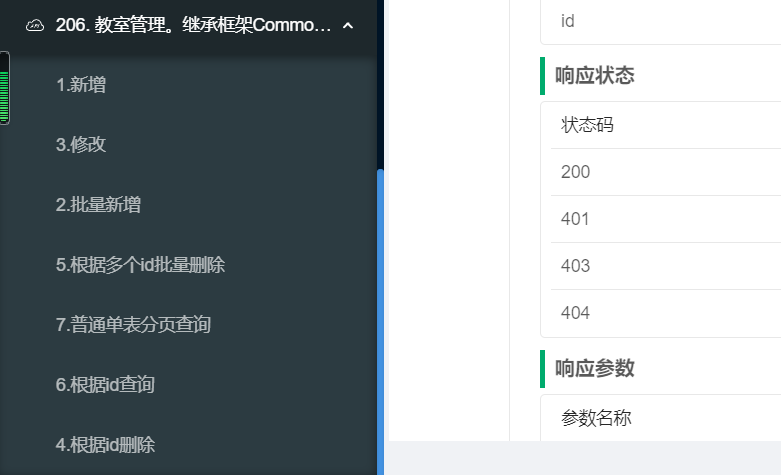

### 弱约束写法
弱约束写法是指继承CommonXX系类来开发业务逻辑，相比继承BaseXX系列的强约束写法，开发者感觉“约束感很弱”，相对更加自由和灵活。
CommonXX提供了最小化的开发规范和功能。

我们使用教室实体表Room业务逻辑来演示弱约束写法。

1. 持久层定义领域对象
1. 持久层声明Repository
1. 定义数据转换对象DTO
1. 业务层定义Service
1. 接口层定义Controller
1. 使用Swagger测试接口

#### 1.持久层定义领域对象
首先需要定义 Room 都有哪些属性、与其他实体有什么关系，也就是首先定义领域对象。

```java
/**
 * 教室管理实体类, 继承CommonXXX,弱约束方式
 **/
@Data
@NoArgsConstructor
@Entity
@Table(name = "room")
@Where(clause = "flag=1")
public class Room extends CommonDomain {
    private static final long serialVersionUID = 7578292815543449813L;

    @Id
    private String pk;

    @CommonJpaQueryWord(func = CommonJpaQueryWord.MatchType.like)
    private String roomName;

    @CommonJpaQueryWord(func = CommonJpaQueryWord.MatchType.like)
    private String roomDesc;

    private Integer flag;
}

```
1. 弱约束写法继承 CommonDomain，CommonDomain没有定义任何属性，只是起到一种类型约束作用
1. pk属性上面增加了@Id,弱约束写法需要指定每个表的ID字段
1.  弱约束写法仍然可以使用@CommonJpaQueryWord注解

#### 2.持久层声明Repository
```java
public interface RoomRepository extends ICommonDaoRepository<Room> {

}

```
弱约束写法需要继承 ICommonDaoRepository，泛型为Room。ICommonDaoRepository 本身继承了JpaRepository,JpaSpecificationExecutor等等

#### 3.定义数据转换对象DTO
```java
/**
 * 教室管理DTO, 继承CommonXXX,弱约束方式
 **/
@ApiModel(value = "RoomDTO对象")
@Data
@NoArgsConstructor
public class RoomDTO extends CommonDTO {
    private static final long serialVersionUID = 255881111428876699L;

    private String pk;

    @Size(min = 2, max = 20, message = "学生班级长度只能在2-20之间")
    private String roomName;

    private String roomDesc;

    private Integer flag;
}
```
继承 CommonDTO，CommonDTO 没有定义任何属性，只是起到一种类型约束作用

#### 4.业务层定义Service
弱约束区别强约束，没有预置CRUD方法，因此需要写具体的CRUD，代码量会增加很多。
```java
public interface IRoomService extends ICommonService<RoomDTO, Room> {

    RoomDTO create(RoomDTO roomDTO);

    boolean removeById(String id);

    boolean removeByIds(List<String> ids);

    RoomDTO findById(String id);

    List<RoomDTO> findByIds(List<String> ids);

    boolean batchCreate(List<RoomDTO> teacherDTOList);

    RoomDTO update(RoomDTO roomDTO);

    default boolean remove(RoomDTO roomDTO) {
        return removeById(roomDTO.getPk());
    }

    @Transactional(rollbackFor = Exception.class)
    default boolean batchRemove(List<RoomDTO> teacherDTOList) {
        List<String> idList = new ArrayList<>();

        teacherDTOList.forEach(t -> {
            idList.add(t.getPk());
        });
        return removeByIds(idList);
    }

    default void beforeRemove(List<String> ids) {
        if (CollectionUtils.isEmpty(ids)) {
            throw new ValidateException("ID集合不能为空");
        }
        for (String id : ids) {
            if (StringUtils.isBlank(id)) {
                throw new ValidateException("ID不能为空");
            }
        }
    }

    default RoomDTO beforeCreate(RoomDTO roomDTO) {
        if (!StringUtils.isBlank(roomDTO.getPk())) {
            throw new CommonException("新增时候Id属性不能有值,此方法只能用于新增操作，更新请调用update方法");
        }
        roomDTO.setPk(IdUtil.simpleUUID());
        // 初始化
        roomDTO.setFlag(1);
        return roomDTO;
    }
}
```
1. 继承 ICommonService，ICommonService只有基础的DTO与Domain映射方法、getPage方法
1. 自定义了很多常用的CRUD方法

其次定义业务逻辑具体实现：
```java
@Service
public class RoomServiceImpl  extends CommonServiceImpl<RoomRepository, Room, RoomDTO> implements IRoomService {

    @Override
    @Transactional(rollbackFor = Exception.class)
    public RoomDTO create(RoomDTO roomDTO) {
        roomDTO = beforeCreate(roomDTO);
        Room t = dtoToDomain(roomDTO, true);
        t = iBaseRepository.saveAndFlush(t);

        return domainToDTO(t, true);
    }

    @Override
    @Transactional(rollbackFor = Exception.class)
    public boolean removeById(String id) {
        beforeRemove(Arrays.asList(id));
        RoomDTO dto = new RoomDTO();
        dto.setPk(id);
        dto.setFlag(0);
        update(dto);
        return true;
    }

    @Override
    @Transactional(rollbackFor = Exception.class)
    public boolean removeByIds(List<String> ids) {
        beforeRemove(ids);
        Set<String> cacheKeys = new HashSet<>();
        List<Room> allById = iBaseRepository.findAllById(ids);
        if (!CollectionUtils.isEmpty(allById)) {
            allById.forEach(entity -> {
                entity.setFlag(0);
            });
            iBaseRepository.saveAll(allById);
        }
        return true;
    }

    @Override
    @Transactional(rollbackFor = Exception.class)
    public boolean batchCreate(List<RoomDTO> teacherDTOList) {
        List<Room> ts = new ArrayList();
        teacherDTOList.forEach(dto -> {
            dto = beforeCreate(dto);
            Room t = dtoToDomain(dto, true);
            ts.add(t);
        });
        iBaseRepository.saveAll(ts);
        iBaseRepository.flush();

        return true;
    }

    @Override
    @Transactional(rollbackFor = Exception.class)
    public RoomDTO update(RoomDTO roomDTO) {
        if (StringUtils.isBlank(roomDTO.getPk())) {
            throw new ValidateException("ID不能为空");
        }
        Room t = dtoToDomain(roomDTO, false);

        String id = t.getPk();
        Optional<Room> old = iBaseRepository.findById(id);
        if (old.isPresent()) {
            Room oldDomain = old.get();
            CommonBeanUtil.updateCopy(t, oldDomain);
            return domainToDTO(iBaseRepository.saveAndFlush(oldDomain), true);
        }
        throw new CommonException("没有找到此对象，无法更新");
    }

    @Override
    public RoomDTO findById(String id) {
        Optional<Room> t = iBaseRepository.findById(id);
        if (!t.isPresent()) {
            return null;
        }
        return domainToDTO(t.get(), true);
    }

    @Override
    public List<RoomDTO> findByIds(List<String> ids) {
        if (CollectionUtils.isEmpty(ids)) {
            return new ArrayList();
        }
        List<Room> ts = iBaseRepository.findAllById(ids);
        List<RoomDTO> dtos = domainListToDTOList(ts, true);
        return dtos;
    }
}
```
1. 继承 CommonServiceImpl
1. 具体实现IRoomService自定义的基础CRUD方法
1. 可以充分利用dtoToDomain等映射方法简化逻辑
1. @Transactional(rollbackFor = Exception.class)，注意事务配置

#### 5.接口层定义Controller
```java

@RestController
@Api(tags = {"206. 教室管理。继承框架CommonXX的弱约束写法"})
@RequestMapping("/sample/room")
public class RoomController extends CommonController<IRoomService, RoomDTO> {
    @Valid
    @ApiOperation(value = "1.新增")
    @ApiOperationSupport(order = 1)
    @PostMapping
    public ResultDTO<RoomDTO> create(@RequestBody RoomDTO dto) throws BaseException {
        RoomDTO resultDTO = (RoomDTO) iBaseService.create(dto);
        return new ResultDTO(resultDTO);
    }

    @ApiOperation(value = "2.批量新增")
    @ApiOperationSupport(order = 2)
    @PostMapping("/batchCreate")
    public ResultDTO batchCreate(@RequestBody List<RoomDTO> dtos) throws BaseException {
        iBaseService.batchCreate(dtos);
        return new ResultDTO();
    }

    @Valid
    @ApiOperation(value = "3.修改")
    @ApiOperationSupport(order = 3)
    @PutMapping
    public ResultDTO<String> update(@RequestBody RoomDTO dto) throws BaseException {
        RoomDTO resultDTO = (RoomDTO) iBaseService.update(dto);
        return new ResultDTO(resultDTO);
    }

    @ApiOperation(value = "4.根据id删除")
    @ApiOperationSupport(order = 4)
    @DeleteMapping("/{id}")
    public ResultDTO<Boolean> deleteById(@PathVariable("id") String id) throws BaseException {
        Boolean isSuccess = iBaseService.removeById(id);
        return new ResultDTO<>(isSuccess);
    }

    @ApiOperation(value = "5.根据多个id批量删除")
    @ApiOperationSupport(order = 5)
    @DeleteMapping("/deleteByIds")
    public ResultDTO<Boolean> deleteByIds(@RequestBody List<String> ids) throws BaseException {
        Boolean isSuccess = iBaseService.removeByIds(ids);
        return new ResultDTO<>(isSuccess);
    }

    @ApiOperation(value = "6.根据id查询")
    @ApiOperationSupport(order = 6)
    @GetMapping("/{id}")
    public ResultDTO<RoomDTO> selectById(@PathVariable("id") String id) throws BaseException {
        RoomDTO byId = iBaseService.findById(id);
        return new ResultDTO(byId);
    }
}

```
继承 CommonController，弱约束写法的controller也需要自己基础的CRUD，因此代码量也会多一些。CommonController中有
基础的单表分页接口。

#### 6.使用Swagger测试接口
Room 业务逻辑代码全部完成以后，可以运行项目，使用Swagger接口进行测试。



#### 7.小结
弱约束写法可以使用PageDTO、ResultDTO等等Diamond Common中的基础能力。
弱约束写法比强约束写法更加“自由”，但同时比强约束写法的代码工作量更大，稳定性也不如强约束写法。