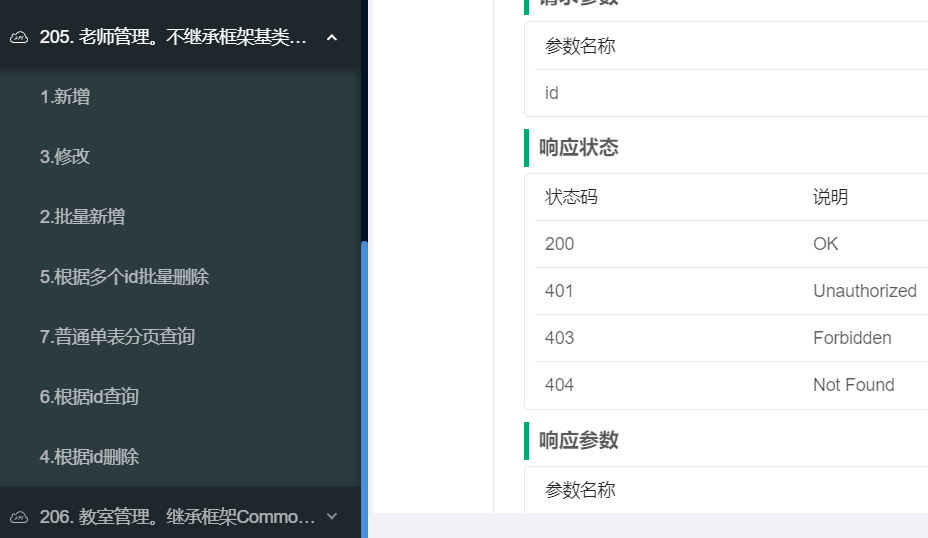

### 无约束写法
无约束写法是指既不继承BaseXX也不继承CommonXX，而是使用Spring Boot原始写法来实现业务逻辑。
无约束写法仍然可以使用PageDTO，ResultDTO等等一系列开发规范和功能。

以 Teacher（老师实体表）业务逻辑为例，介绍无约束写法。

1. 持久层定义领域对象
1. 持久层声明Repository
1. 定义数据转换对象DTO
1. 业务层定义Service
1. 接口层定义Controller
1. 使用Swagger测试接口

#### 1.持久层定义领域对象
首先需要定义 Teacher 都有哪些属性、与其他实体有什么关系，也就是首先定义领域对象。

```java
/**
 * 不继承，JPA原始写法，老师管理实体类
 **/
@Data
@NoArgsConstructor
@Entity
@Table(name = "teacher")
@Where(clause = "flag=1")
public class Teacher {
    private static final long serialVersionUID = 7578293434541249813L;

    @Id
    private String pk;

    @CommonJpaQueryWord(func = CommonJpaQueryWord.MatchType.like)
    private String teacherName;

    @CommonJpaQueryWord(func = CommonJpaQueryWord.MatchType.like)
    private String teacherSex;

    private Integer flag;
}

```
1. 不继承任何类
1. pk属性上面增加了@Id,表示主键
1. 无约束写法仍然可以使用@CommonJpaQueryWord注解

#### 2.持久层声明Repository
```java
public interface TeacherRepository extends JpaRepository<Teacher, String>, JpaSpecificationExecutor<Teacher> {

}
```
直接继承JPA原生的JpaRepository,JpaSpecificationExecutor等等

#### 3.定义数据转换对象DTO
```java
/**
 * 类描述：不继承，JPA原始写法，老师管理DTO对象
 **/
@ApiModel(value = "Teacher对象")
@Data
@NoArgsConstructor
public class TeacherDTO {
    private static final long serialVersionUID = 2558887945428876699L;

    private String pk;

    @Size(min = 2, max = 20, message = "姓名长度只能在2-20之间")
    private String teacherName;

    private String teacherSex;

    private Integer flag;
}
```
DTO也不继承任何类

#### 4.业务层定义Service
不继承任何类，因此所有的CRUD逻辑都需要写。
```java

public interface ITeacherService {

    CommonPageDTO<TeacherDTO> getPage(CommonPageDTO<TeacherDTO> commonPageDTO);

    TeacherDTO create(TeacherDTO teacherDTO);

    boolean removeById(String id);

    boolean removeByIds(List<String> ids);

    TeacherDTO findById(String id);

    List<TeacherDTO> findByIds(List<String> ids);

    boolean batchCreate(List<TeacherDTO> teacherDTOList);

    TeacherDTO update(TeacherDTO teacherDTO);

    default boolean remove(TeacherDTO teacherDTO) {
        return removeById(teacherDTO.getPk());
    }

    @Transactional(rollbackFor = Exception.class)
    default boolean batchRemove(List<TeacherDTO> teacherDTOList) {
        List<String> idList = new ArrayList<>();

        teacherDTOList.forEach(t -> {
            idList.add(t.getPk());
        });
        return removeByIds(idList);
    }

    default void beforeRemove(List<String> ids) {
        if (CollectionUtils.isEmpty(ids)) {
            throw new ValidateException("ID集合不能为空");
        }
        for (String id : ids) {
            if (StrUtil.isBlank(id)) {
                throw new ValidateException("ID不能为空");
            }
        }
    }

    default TeacherDTO beforeCreate(TeacherDTO teacherDTO) {
        if (!StrUtil.isBlank(teacherDTO.getPk())) {
            throw new CommonException("新增时候Id属性不能有值,此方法只能用于新增操作，更新请调用update方法");
        }
        teacherDTO.setPk(IdUtil.simpleUUID());
        // 初始化
        teacherDTO.setFlag(1);
        return teacherDTO;
    }
}
```
自定义了常用的CRUD方法

其次定义业务逻辑具体实现：
```java

@Service
public class TeacherServiceImpl implements ITeacherService {
    @Autowired
    private TeacherRepository teacherRepository;

    public CommonPageDTO<TeacherDTO> getPage(CommonPageDTO<TeacherDTO> commonPageDTO) {
        PageRequest pageable = CommonJpaPageUtil.getInstance().toPageRequest(commonPageDTO, "key");
        TeacherDTO dto = commonPageDTO.getFilters();
        Teacher domain = dtoToDomain(dto,true);
        Specification<Teacher> specification = CommonJpaPageUtil.getInstance().objToSpecWithLogicType(domain, "and");

        Page<Teacher> pageList = teacherRepository.findAll(specification, pageable);
        commonPageDTO.setTotal(pageList.getTotalElements());
        commonPageDTO.setList(domainListToDTOList(pageList.getContent(), true));
        return commonPageDTO;
    }

    private Specification<Teacher> toSpecWithLogicType(TeacherDTO teacherDTO) {
        return (root, criteriaQuery, cb) -> {
            //获取查询类Query的所有字段,包括父类字段
            List<Predicate> predicates = new ArrayList();

            //通过注解上func属性,构建路径表达式
            predicates.add(cb.like(root.get("teacherName"), "%" + teacherDTO.getTeacherName() + "%"));
            predicates.add(cb.like(root.get("teacherSex"), "%" + teacherDTO.getTeacherSex() + "%"));
            return cb.and(predicates.toArray(new Predicate[predicates.size()]));//and连接
        };
    }

    @Override
    @Transactional(rollbackFor = Exception.class)
    public TeacherDTO create(TeacherDTO teacherDTO) {
        teacherDTO = beforeCreate(teacherDTO);
        Teacher t = dtoToDomain(teacherDTO, true);
        t = teacherRepository.saveAndFlush(t);

        return domainToDTO(t, true);
    }

    @Override
    @Transactional(rollbackFor = Exception.class)
    public boolean removeById(String id) {
        beforeRemove(Arrays.asList(id));
        TeacherDTO dto = new TeacherDTO();
        dto.setPk(id);
        dto.setFlag(0);
        update(dto);
        return true;
    }

    @Override
    @Transactional(rollbackFor = Exception.class)
    public boolean removeByIds(List<String> ids) {
        beforeRemove(ids);
        Set<String> cacheKeys = new HashSet<>();
        List<Teacher> allById = teacherRepository.findAllById(ids);
        if (!CollectionUtils.isEmpty(allById)) {
            allById.forEach(entity -> {
                entity.setFlag(0);
            });
            teacherRepository.saveAll(allById);
        }
        return true;
    }

    @Override
    @Transactional(rollbackFor = Exception.class)
    public boolean batchCreate(List<TeacherDTO> teacherDTOList) {
        List<Teacher> ts = new ArrayList();
        teacherDTOList.forEach(dto -> {
            dto = beforeCreate(dto);
            Teacher t = dtoToDomain(dto, true);
            ts.add(t);
        });
        teacherRepository.saveAll(ts);
        teacherRepository.flush();

        return true;
    }

    @Override
    @Transactional(rollbackFor = Exception.class)
    public TeacherDTO update(TeacherDTO teacherDTO) {
        if (StrUtil.isBlank(teacherDTO.getPk())) {
            throw new ValidateException("ID不能为空");
        }
        Teacher t = dtoToDomain(teacherDTO, false);

        String id = t.getPk();
        Optional<Teacher> old = teacherRepository.findById(id);
        if (old.isPresent()) {
            Teacher oldDomain = old.get();
            CommonBeanUtil.updateCopy(t, oldDomain);
            return domainToDTO(teacherRepository.saveAndFlush(oldDomain), true);
        }
        throw new CommonException("没有找到此对象，无法更新");
    }

    @Override
    public TeacherDTO findById(String id) {
        Optional<Teacher> t = teacherRepository.findById(id);
        if (!t.isPresent()) {
            return null;
        }
        return domainToDTO(t.get(), true);
    }

    @Override
    public List<TeacherDTO> findByIds(List<String> ids) {
        if (CollectionUtils.isEmpty(ids)) {
            return new ArrayList();
        }
        List<Teacher> ts = teacherRepository.findAllById(ids);
        List<TeacherDTO> dtos = domainListToDTOList(ts, true);
        return dtos;
    }

    private TeacherDTO domainToDTO(Teacher domain, Boolean isCopyEmptyField) {
        if (domain == null) {
            return null;
        }
        TeacherDTO dto = new TeacherDTO();
        if (isCopyEmptyField) {
            CommonBeanUtil.saveCopy(domain, dto);
        } else {
            CommonBeanUtil.updateCopy(domain, dto);
        }
        return dto;
    }

    private Teacher dtoToDomain(TeacherDTO dto, Boolean isCopyEmptyField) {
        if (dto == null) {
            return null;
        }
        Teacher t = new Teacher();
        if (isCopyEmptyField) {
            CommonBeanUtil.saveCopy(dto, t);
        } else {
            CommonBeanUtil.updateCopy(dto, t);
        }
        return t;
    }

    private List<TeacherDTO> domainListToDTOList(List<Teacher> dList, Boolean isCopyEmptyField) {
        List<TeacherDTO> dtoList = new ArrayList();
        dList.forEach(d ->
                dtoList.add(domainToDTO(d, isCopyEmptyField))
        );
        return dtoList;
    }

    private List<Teacher> dtoListToDomainList(List<TeacherDTO> dtoList, Boolean isCopyEmptyField) {
        List<Teacher> dList = new ArrayList();
        dtoList.forEach(dto -> {
            dList.add(dtoToDomain(dto, isCopyEmptyField));
        });
        return dList;
    }
}

```
1. 不继承
1. 具体实现 ITeacherService 自定义的基础CRUD方法
1. 需要自定义DTO和Domain的映射

#### 5.接口层定义Controller
```java

@RestController
@Api(tags = {"205. 老师管理。不继承框架基类，JPA原始写法"})
@RequestMapping("/sample/teacher")
public class TeacherController {
    protected Logger log = LoggerFactory.getLogger(getClass());
    @Autowired
    protected ITeacherService iBaseService;

    @Autowired
    protected MessageSource messageSource;

    @Valid
    @ApiOperation(value = "1.新增")
    @ApiOperationSupport(order = 1)
    @PostMapping
    public ResultDTO<TeacherDTO> create(@RequestBody TeacherDTO dto) throws BaseException {
        TeacherDTO resultDTO = (TeacherDTO) iBaseService.create(dto);
        return new ResultDTO(resultDTO);
    }

    @ApiOperation(value = "2.批量新增")
    @ApiOperationSupport(order = 2)
    @PostMapping("/batchCreate")
    public ResultDTO batchCreate(@RequestBody List<TeacherDTO> dtos) throws BaseException {
        iBaseService.batchCreate(dtos);
        return new ResultDTO();
    }

    @Valid
    @ApiOperation(value = "3.修改")
    @ApiOperationSupport(order = 3)
    @PutMapping
    public ResultDTO<String> update(@RequestBody TeacherDTO dto) throws BaseException {
        TeacherDTO resultDTO = (TeacherDTO) iBaseService.update(dto);
        return new ResultDTO(resultDTO);
    }

    @ApiOperation(value = "4.根据id删除")
    @ApiOperationSupport(order = 4)
    @DeleteMapping("/{id}")
    public ResultDTO<Boolean> deleteById(@PathVariable("id") String id) throws BaseException {
        Boolean isSuccess = iBaseService.removeById(id);
        return new ResultDTO<>(isSuccess);
    }

    @ApiOperation(value = "5.根据多个id批量删除")
    @ApiOperationSupport(order = 5)
    @DeleteMapping("/deleteByIds")
    public ResultDTO<Boolean> deleteByIds(@RequestBody List<String> ids) throws BaseException {
        Boolean isSuccess = iBaseService.removeByIds(ids);
        return new ResultDTO<>(isSuccess);
    }

    @ApiOperation(value = "6.根据id查询")
    @ApiOperationSupport(order = 6)
    @GetMapping("/{id}")
    public ResultDTO<TeacherDTO> selectById(@PathVariable("id") String id) throws BaseException {
        TeacherDTO byId = iBaseService.findById(id);
        return new ResultDTO(byId);
    }

    @Valid
    @ApiOperation(value = "7.普通单表分页查询")
    @ApiOperationSupport(order = 7)
    @PostMapping(value = "/search")
    public ResultDTO<CommonPageDTO<TeacherDTO>> selectByPage(@RequestBody CommonPageDTO<TeacherDTO> pageDTO) {
        pageDTO = iBaseService.getPage(pageDTO);
        return new ResultDTO(pageDTO);
    }
}

```
不继承，需要手写所有的接口。

#### 6.使用Swagger测试接口
Room 业务逻辑代码全部完成以后，可以运行项目，使用Swagger接口进行测试。



#### 7.小结
无约束写法自由灵活，可以完全不受框架限制，但是无约束写法代码量更大，同时稳定性、开发效率、安全性等等都相应降低。
从代码量来说，实现文中相同功能，即使实际项目采用文中十分精简的代码风格来写，都是强约束写法代码量的10倍之多。
