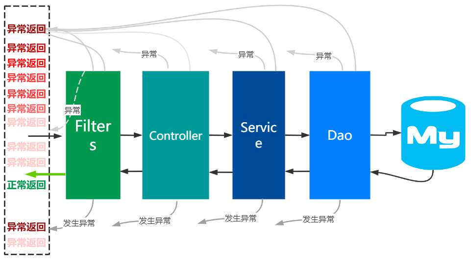

### 统一异常
在实际项目写具体业务逻辑接口，我们常常有一种感觉：“正常返回逻辑情况只有一种，而异常返回情况却多种多样”！需要“浪费”大量的代码去
判断各种异常情况，由于现实中我们无法穷举所有异常，所以在编码时候常常放弃穷举，只是针对所谓的主要异常进行编码，这样做貌似
抓住了重点、解决了问题，实际上导致业务存在严重的逻辑漏洞。Spring Boot提供的统一异常功能就是为了解决这个问题，开发者几乎可以
只关注正常返回情况和重要的个别业务异常返回情况的同时，放心地将剩余异常情况"遗漏"给统一异常处理器来处理，而不用担心有业务逻辑漏洞。
统一异常除了可以提高程序稳定性,更重要的是可以大幅度降低代码量。

#### 统一异常工作原理
以Spring Boot的Servlet体系为例，从前端请求到后端返回数据，逻辑数据流如下：


请求经过filters层-->Controller层-->Service层-->Dao层，每一层的代码逻辑都可能有异常情况发生，可以这样描述一个实际业务逻辑接口：


每一层都可能需要处理独特的很多异常情况，比如常见的参数不可以Null、密码必须大于6位、code字段不能重复等等“无穷无尽”的异常情况。
我们不仅需要纠结“参数不可以Null这个逻辑是写在Controller层呢还是Service层？”的问题，更严重的是我们每一套正常逻辑的几行代码周围
都要围绕着异常判断逻辑的成百上千的“垃圾”代码，那将是令人尴尬的。因此Diamond Common依赖Spring Boot，提供了Controller层以下的
统一异常功能和开发规范，帮助开发者聚焦在核心业务逻辑开发：


统一异常是通过使用@RestControllerAdvice注解声明切面、@ExceptionHandler注解声明异常处理器来实现的，
Diamond Common提供了异常处理器抽象基类 BaseExceptionHandler，BaseExceptionHandler 内置了一些基础异常处理方法，
以防漏掉一些异常，起'保底'作用。

```java
public abstract class BaseExceptionHandler {
    private static final Logger logger = LoggerFactory.getLogger(BaseExceptionHandler.class);

    private static final String ERROR_MES_SEPARATOR = "####";
    
   ...

    /**
     * 基础异常，如果实际项目没有覆盖，则会被此handler捕捉处理
     */
    @ExceptionHandler(BaseException.class)
    @ResponseBody
    public ResponseEntity<ResultDTO> baseExceptionHandler(HttpServletRequest request, BaseException ex) {
        // 框架自定义异常属于业务异常，统一返回200状态
        logger.error(ex.getMessage(), ex);
        return new ResponseEntity<>(new ResultDTO<>(ex.getCode(), ex.getMessage(), ""), HttpStatus.OK);
    }

   ...

    /**
     * 最基础异常封装，起"保底"作用
     */
    @ExceptionHandler(Exception.class)
    @ResponseBody
    public ResponseEntity<ResultDTO> runtimeExceptionHandler(HttpServletRequest request, Exception ex) {
        HttpStatus status = getStatus(request);
        String messageDetail = ex.getMessage();
        String message = "服务器开小差了";
        //判断是否包含中文，如果包含中文，则拼接到message中
        Matcher m = Pattern.compile("[\u4e00-\u9fa5]").matcher(messageDetail);
        if (m.find()) {
            message = messageDetail;
        }
        logger.error(ex.getMessage(), ex);
        return new ResponseEntity<>(new ResultDTO<>(status.value(), message + ERROR_MES_SEPARATOR + messageDetail, ""), status);
    }

    public HttpStatus getStatus(HttpServletRequest request) {
        Integer statusCode = (Integer) request.getAttribute("javax.servlet.error.status_code");
        if (statusCode == null) {
            return HttpStatus.INTERNAL_SERVER_ERROR;
        }
        return HttpStatus.valueOf(statusCode);
    }
   ...
}
```

实际项目需要自定义异常处理器，继承自BaseExceptionHandler来开启统一异常功能。

为了方便统一异常捕获，Diamond Common定义了异常基类BaseException，建议实际项目的所有自定义异常类继承自BaseException。

下面介绍实际项目如何使用统一异常。

#### 自定义异常
实际项目都会用各种个性化的异常种类，因此都有自定义异常的需求。我们常常从业务模块角度或者异常自身描述的角度来区分异常，比如：
1. 按照业务模块来拆分：模块A异常类AException、模块B异常类BException等等。
1. 按照异常自身描述来拆分：参数异常ParameterException、高可用心跳异常HAException等等

两种分类方法各有优劣，有各自的适用场景。无论实际项目使用哪种分类方法，Diamond Common都强烈建议自定义异常类继承自BaseException。

以diamond sample示例代码为例，模拟了一个按照业务模块角度分类的自定义异常：DiamondSampleException

```java
/**
 * 用户自定义业务异常类
 */
@Data
@NoArgsConstructor
public class DiamondSampleException extends BaseException {
    private static final Long serialVersionUID = 1L;
    // code为异常状态码，用户需要注意状态码的分配不重复（重复后容易产生混淆）
    // 建议使用http状态码后面补充两位数字的格式进行定义
    private static final Integer code = 41001;

    public DiamondSampleException(String template, Object... params) {
        super(template, params);
    }

    public DiamondSampleException(Throwable cause, String template, Object... params) {
        super(cause, template, params);
    }

    @Override
    public Integer getCode() {
        return code;
    }
}
```

1. 继承自 BaseException
1. code属性是异常状态码，当发生异常时候，异常状态码将会设置到ResultDTO的code属性中，因此需要注意状态码的分配不重复（重复后容易产生混淆）。

#### 自定义异常处理器
自定义异常实际项目的异常处理器：DiamondSampleExceptionHandler 。  
通常一个项目只需要定义一个异常处理器即可，当然也可以定义多个异常处理器类，注意多个异常处理器方法的优先级即可。

```java
/**
 * 客户可以自定义全局异常处理逻辑,来覆盖Diamond框架的默认处理逻辑
 * BaseExceptionHandler的优先级最低
 */
@RestControllerAdvice(basePackages = "com.sample.diamond")
@Order
public class DiamondSampleExceptionHandler extends BaseExceptionHandler {
    private static Logger logger = LoggerFactory.getLogger(DiamondSampleExceptionHandler.class);

    @ExceptionHandler(RuntimeException.class)
    public ResponseEntity<ResultDTO> handleIllegalParamException(HttpServletRequest request, RuntimeException ex) {
        HttpStatus status = getStatus(request);
        //TODO 用户自定义逻辑，根据异常类型动态拼接返回值
        if (ex instanceof DiamondSampleException) {
            return new ResponseEntity(new ResultDTO(status.value(), ex.getMessage(), ""), status);
        } else {
            return new ResponseEntity(new ResultDTO(2, ex.getMessage(), ""), status);
        }
    }
}
```

1. @RestControllerAdvice注解声明`basePackages = "com.sample.diamond"`下的所有Controller接口切入点。
1. 继承 BaseExceptionHandler，BaseExceptionHandler提供了起到保底作用的几个异常处理方法：
1. 一般情况下不再需要自定义异常处理逻辑,BaseExceptionHandler已经满足需求。如果有特殊需求可以新增异常处理逻辑，
如handleIllegalParamException。
1. 注意优先级问题，当多个异常处理器发生冲突时候，子类的异常处理器优先级比父类高。

#### 统一异常机制下业务逻辑写法（非常重要）
对于统一异常机制下如何写代码，从而大幅度降低代码量，体现在以下几个方面：
1. `不要try catch，只要throw`：尽量避免写`try catch`语句。分层架构时候我们常常纠结于到底将try catch语句写在controller层还是service层？答案是在统一异常规范下，
在任何层都尽量不要写try catch，而是直接throw。
1. `还是只要throw`：不需要根据各种异常逻辑主动拼装ResultDTO，各种异常逻辑只需要放心 throw 抛出异常即可，如StudentServiceImpl的beforeCreate方法：
    ```java
    @Override
    public StudentDTO beforeCreate(StudentDTO dto) {
        if (StrUtil.isEmpty(dto.getStudentClass())) {
            throw new DiamondSampleException("学生班级不能为空");
        }
        if (StrUtil.isEmpty(dto.getStudentName())) {
            throw new DiamondSampleException("学生姓名不能为空");
        }
        if (StrUtil.isEmpty(dto.getStudentSex())) {
            throw new DiamondSampleException("学生性别不能为空");
        }
        return super.beforeCreate(dto);
    }
    ```
    各种异常情况只需要 `throw new DiamondSampleException("xxx");`,
    异常处理器会自动将异常包装为对应的ResultDTO返回给前端。
1. `仍然只要throw`: 尽量减少if else逻辑代码片段。与try catch类似，有了统一异常规范，开发者只需要关注正常返回的业务逻辑，可以
不用再担心异常考虑不周全的情况，因此可以减少不必要的if else逻辑判断。
1. 前端可以直接展示ResultDTO中message字段信息。我们常常面临一个问题：后端返回的异常描述信息经常模棱两可或者描述不清，导致无法直接在浏览器中展示给用户，经常需要前端再
转换成对用户更友好的提示，那么针对异常情况的用户提示怎么做才好呢？答案是：
    1. 自定义异常的code要定义好，方便前端根据code值来转换为响应的友好提示信息
    1. Diamond Common统一异常返回的ReultDTO的message格式中有一个小规范，message由三部分组成：{描述信息}####{java异常堆栈}。描述信息和java异常堆栈通过
    4个井号分割，因此前端可以取{描述信息}部分展示给用户，而{java异常堆栈}部分可以用于调试程序。
1. 对i18n国际化友好。可以使用Spring Boot推荐的国际化方式，统一异常描述信息对国际化支持友好。

#### 小结
统一异常是一种基于切面思想的编程方法，Diamond Common基于这种方法进一步提供了开发规范，可以
大幅度降低开发代码工作量、提高程序稳定性。