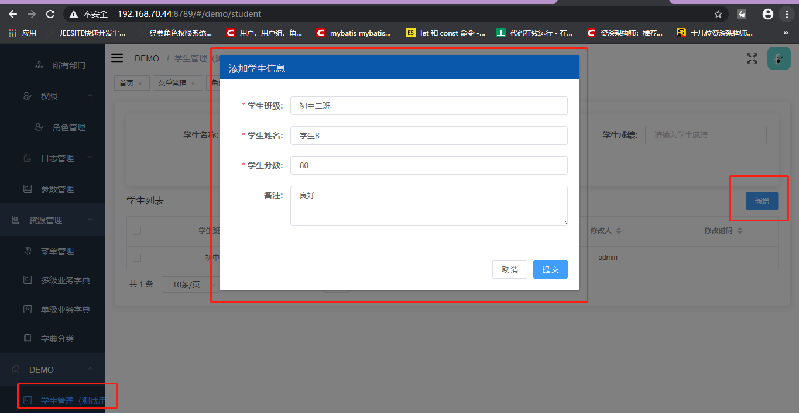
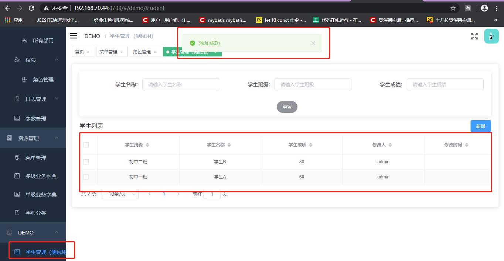

## 概述

* diamond-app-frontend-vue：前端示例
* diamond-app-backend-sample：后端示例

### 开发环境

- npm
- webpack
- vue

### 需求描述

基于Diamond开发了一个简单的学生管理模块，通过学生管理模块向大家说明大家在自己的项目中应该怎样进行开发。

学生管理部分，主要分为以下几个功能：学生管理，课程管理，年级管理，其中学生和课程相关联，年级只作为树状结构进行展示，未将其和其他项进行关联。

后台数据表有如下结构：学生列表在student表中进行管理，课程列表在course中进行管理，学生和课程的关联在course_student_score表中进行管理，
其中该学生该课程的分数也在该表中score字段进行管理，school_grade年级表中对年级的树状结构进行管理。

### 项目配置

前端项目的配置放置在vue-config.js中，其中包括css、别名，环境变量等配置

## 目录结构

```
|-- diamond-ui-vue-sample
    |-- public
    |   |-- favicon.ico       // favicon图标
    |   |-- index.html        // html模板
    |-- src                   // 源代码
        |-- main.js           // 入口文件
        |-- demo              // sample样例
        |   |-- student
        |       |-- api
        |       |   |-- student.js   //student接口
        |       |-- views      //student页面
        |-- diamond
            |-- App.vue        // 入口页面
            |-- main.js        // 入口 加载组件 初始化等
            |-- permission.js  //权限管理
            |-- promission.js  //权限管理
            |-- api            // 所有请求
            |-- assets         // 主题、字体等静态资源
            |-- components     //全局公用组件
            |-- directive      //全局指令
            |-- filters        //全局filter
            |-- icons          //项目所有的svg icons
            |-- mock           //项目mock模拟数据
            |-- router         //路由
            |-- store           //全局store管理
            |-- styles          //全局样式
            |-- utils           //全局公用方法
            |-- views           //view页面
    |-- .babelrc
    |-- .env
    |-- .env.development        //环境变量配置  development模式
    |-- .env.production         //环境变量配置 production模式
    |-- .gitignore              //git忽略项
    |-- babel.config.js         //babel配置
    |-- package.json            //package.json
    |-- README.md               //README.md
    |-- vue.config.js           //webpack扩展配置
```


## 以开发student代码为例讲解开发指南

### 1.前台部分开发

通过前面系统架构-模块组成中讲解，我们可以得知，diamond-app-frontend-vue前台项目结构，我们以学生管理demo为例讲解如何开发新模块。

##### 1.1.如图，创建一个student.js，其中代码为访问后台的增删改查接口。

代码如下：

```vue
import request from '@/utils/request'

const base_url = '/system/student'

export function queryPageLogs(data) {
  return request({
    url: base_url + '/queryStudentList',
    method: 'post',
    data
  })
}

export function add(data) {
  return request({
    url: base_url + '/addStudent',
    method: 'post',
    data
  })
}

export function delLog(data) {
  return request({
    url: base_url + '/deleteStudent',
    method: 'post',
    data
  })
}
export function update(data) {
  return request({
    url: base_url + '/updateStudent',
    method: 'post',
    data
  })
}
```

##### 1.2.同时，创建学生查询页面

query.vue

##### 1.3.创建菜单并赋予当前用户（以admin用户为例）学生菜单的访问权限

* 创建菜单
* 分配权限
* 成功后，admin用户获得student菜单的访问权限

##### 3.2.前台部分启动

在前台命令行窗口中输入：npm run serve

##### 3.3.访问

全部启动成功后，访问localhost：9527，账号：admin 密码：admin 进行访问

## 4.展示示例（增删改查）

* 以上代码编写好后，重启前后台项目，展示新增功能
 
* 查询功能
   

## 5.前端开发规范和常见使用问题

##### 5.1.配置说明（参照注释）

```vue
# 后台接口请求地址
VUE_APP_BASE_API = http://localhost:7779/
# oauth2的请求授权地址
VUE_APP_OAUTH_userAuthorizationUri = http://192.168.99.77:9998/oauth/authorize
# oauth2的clientId
VUE_APP_OAUTH_clientId = diamonduivueTEST
# oauth2的client秘钥
VUE_APP_OAUTH_client_secret = diamonduivue
# oauth2的授权类型
VUE_APP_OAUTH_response_type = code
# oauth2的权限范围
VUE_APP_OAUTH_scope = user_info
# oauth2的临时状态码
VUE_APP_OAUTH_state =
# oauth2授权码类型的重定向地址
VUE_APP_OAUTH_redirect_uri = http://localhost:9527/ssologin
# oauth2的授权类型
VUE_APP_OAUTH_grant_type = authorization_code
# oauth2的获取token的url
VUE_APP_OAUTH_accessTokenUri = http://192.168.99.77:9998/oauth/token
# 利用token获取用户信息的url
VUE_APP_OAUTH_userInfoUri = http://192.168.99.77:9998/me
```
