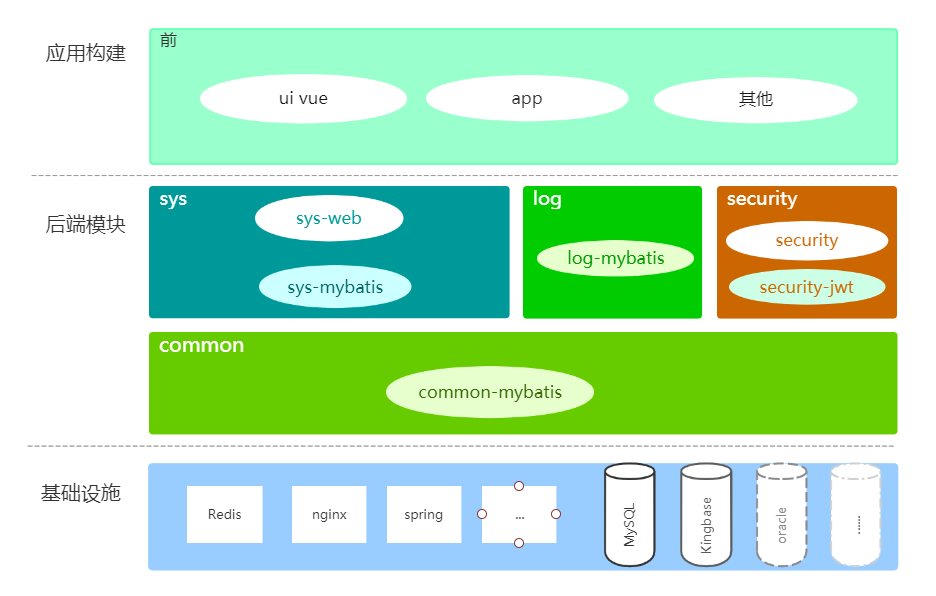

# Diamond开发框架

## 简介

Diamond开发框架是基于SpringBoot + Vue的二次开发框架。由Hoioy主持与研发，开源。
- Diamond框架：https://gitee.com/hoioy/diamond

欢迎大家加入[Diamond问题提交](https://gitee.com/hoioy/diamond/issues)共同学习讨论。

### 价值
Diamond是一个在Spring Boot + Vue基础上定义了`开发规范`和`最佳实践`、
并且提供`基础的系统管理RBAC业务逻辑`(如用户、用户组、角色、权限、机构、菜单、数据字典、日志等通用系统功能)的二次开发框架，
统一了技术体系，提供`非常快速`、`安全稳定`且`优雅`的开发体验。

### Diamond框架模块图

 

## 演示系统
* 演示环境：[Diamond在线示例](http://diamond.hoioy.com/) 
* 用户名/密码：admin/123456 或者 admin/admin

## 贡献代码

欢迎您贡献代码，发起pull request。也可以联系我们将您添加进入开发组

## 版权信息
版权归www.hoioy.com所有