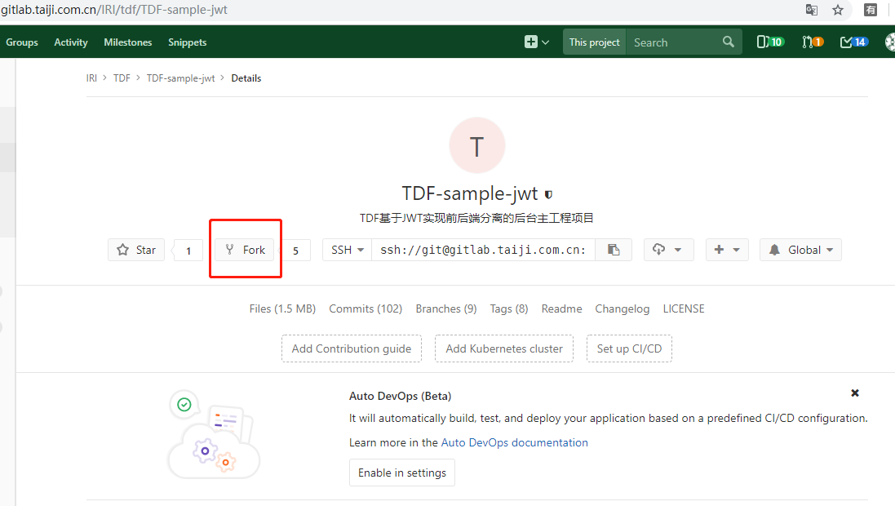
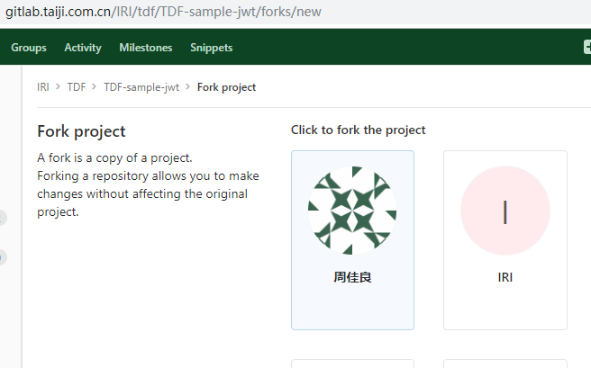
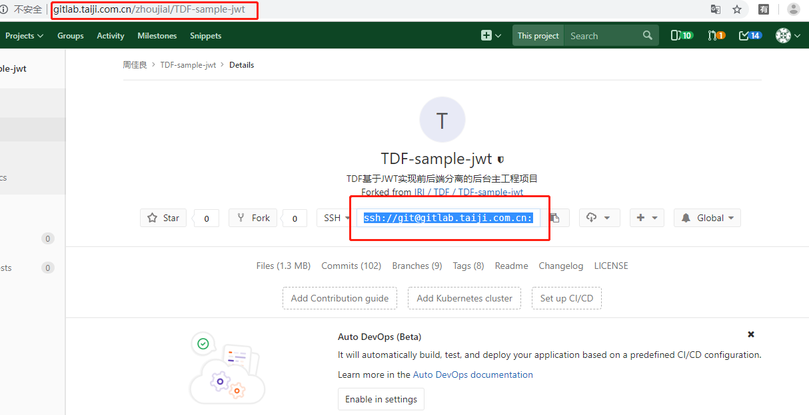
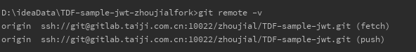
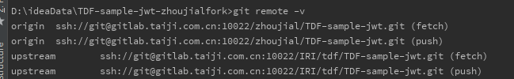
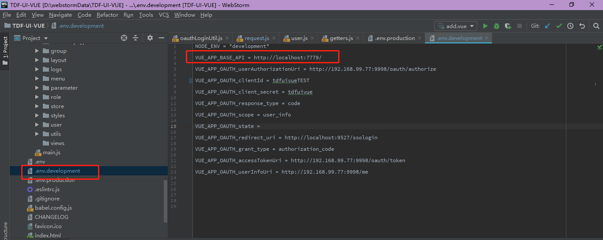
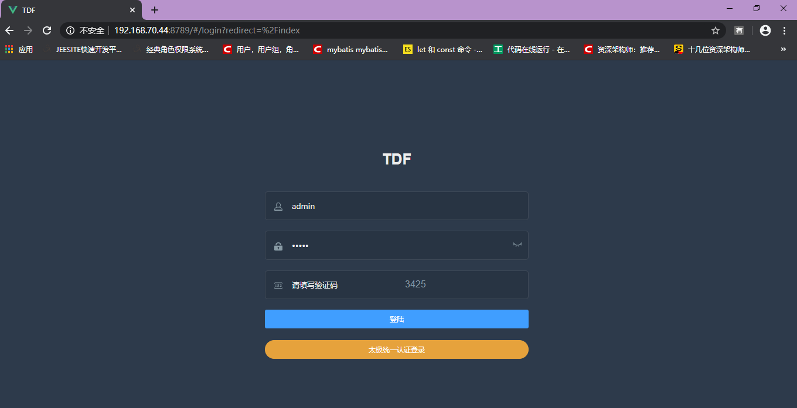
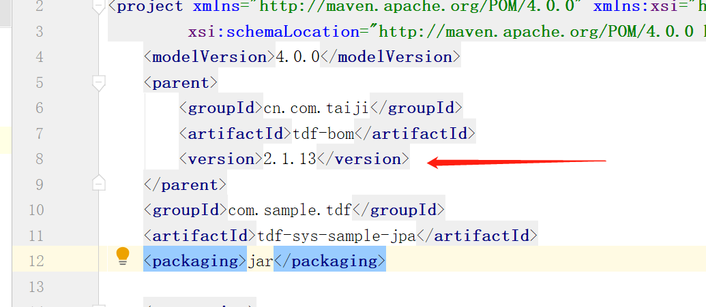
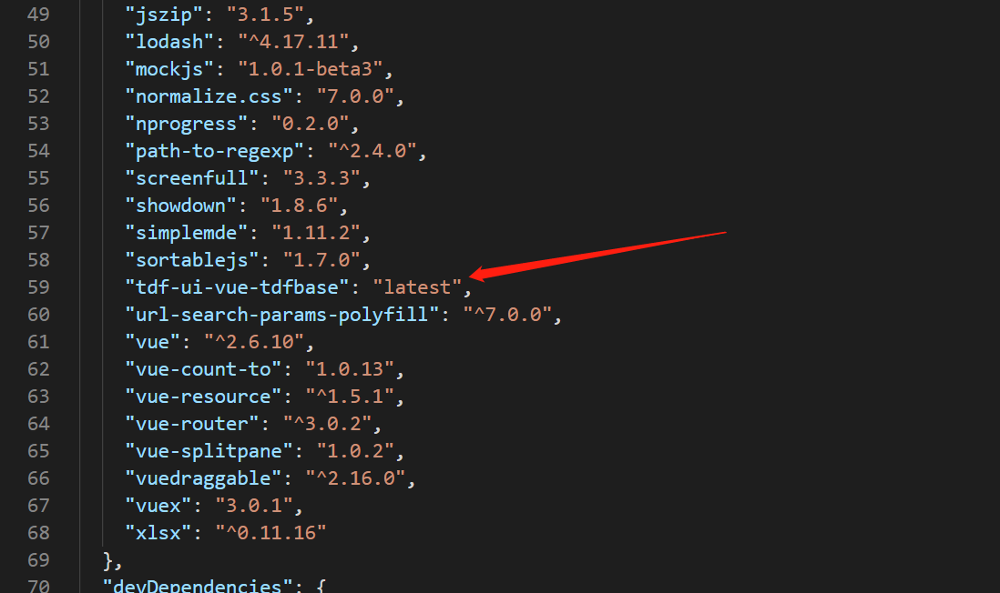

# 快速开始（前后台分离版本）

## 1.项目简介

以tdf-sample为例，快速开始第一个开发项目。

### 1.1.后台部分
项目地址：http://gitlab.taiji.com.cn/IRI/TDF-Base/tdf-sample
ssh地址：[ssh://git@gitlab.taiji.com.cn:10022/IRI/TDF-Base/tdf-sample.git](ssh://git@gitlab.taiji.com.cn:10022/IRI/TDF-Base/tdf-sample.git)

在tdf-sample提供了MyBatis和JPA版本示例 
- tdf-sys-sample-jpa
- tdf-sys-sample-mybatis

### 1.2.前台部分
项目地址：http://gitlab.taiji.com.cn/IRI/TDF-Base/tdf-sample  的 tdf-ui-vue-sample模块
ssh地址：[ssh://git@gitlab.taiji.com.cn:10022/IRI/TDF-Base/tdf-sample.git](ssh://git@gitlab.taiji.com.cn:10022/IRI/TDF-Base/tdf-sample.git)

为了展示开发过程，前台代码中写了一个demo示例，位置在src/demo;
其中api为后台接口请求方法，views为展示层。

## 2.环境准备

### 2.1 环境要求

- java环境：JDK 1.8 
- **Git**配置太极Gitlab
- **Maven**使用太极Maven仓库
- Redis
- MySQL(8.0)

### 2.2 Git配置

从公司gitlab中下载项目，需要设置ssh，设置方式如下

#### 设置Git邮箱名字

在gitbash命令行配置用户名 邮箱
请根据自己的用户名邮箱配置

```
git config --global user.name "chenzhea"
git config --global user.email "chenzhea@mail.taiji.com.cn"
```

#### 生成公私钥

```
ssh-keygen -t rsa     一直回车
```

生成的公私钥在用户目录下.ssh目录下的

#### 登陆太极Gialab

**地址**：http://gitlab.taiji.com.cn/users/sign_in
**一定要点击太极进行登陆**


**进入到设置页面**


**进入到ssh页面**


#### 配置SSH Keys

将用户目录下.ssh目录下的id_rsa.pub里面的内容添加到key中


到此，设置完成，进行测试。

```
git clone ssh://git@gitlab.taiji.com.cn:10022/IRI/TDF-Base/tdf-base-platform.git
```

### 2.3 Maven配置

使用TDF BASE首先你需要配置太极的Maven仓库,下面讲解如何配置

1.  访问http://repo.taiji.com.cn/kb/
2.  下载[settings.xml](http://repo.taiji.com.cn/kb/settings.xml)
3.  覆盖.m2下的setting.xml
4. 修改为如下配置

```
<activeProfiles>
	<activeProfile>nexus</activeProfile>
  </activeProfiles>
```


## 3.创建后台项目

### 3.1.fork，fetch，merge操作

后台使用tdf-sys-sample-jpa项目，该项目使用jpa为orm层，相应mybatis版本请使用tdf-sys-sample-mybatis项目。
进入链接http://gitlab.taiji.com.cn/IRI/TDF-Base/tdf-sample

 

fork代码到自己的仓库，

 

进入自己的仓库，在开发工具中使用ssh地址引入项目

 

如原项目有更新，需要将代码merge到刚刚fork的项目中，则进行以下操作，首先
确定是否建立了主repo的远程源：

git remote -v



如果里面只能看到你自己的两个源(fetch 和 push)，那就需要添加主repo的源：
git remote add upstream URL
再次查看
git remote -v
然后你就能看到upstream了。

 

如果想与主repo合并，进行一下操作：

git fetch upstream

git merge upstream/master

### 3.2. 配置数据库（MySQL为例）

上述配置成功后，开始配置数据库，首先进入数据库，
以命令行方式创建库，库名自行更改
```
 CREATE DATABASE TDF DEFAULT CHARACTER SET utf8mb4 COLLATE utf8mb4_unicode_ci ;
```
创建成功后，修改application-dev.yml，修改数据库：库名，账号密码。

```yaml
spring:
  datasource:
    driver-class-name: "com.mysql.cj.jdbc.Driver"     # mysql 8时候配置
    username: root
    password: root
    url: "jdbc:mysql://localhost:3306/TDF?serverTimezone=GMT%2B8&amp&characterEncoding=utf-8&useSSL=false"
    data: "classpath:/init/mysqldata.sql"      #初始化sql配置
    schema: "classpath:/init/mysqlschema.sql"
```

### 3.3. 修改Redis

修改application-dev.yml 下的Redis配置 修改host和port

```
spring:
  redis:
    database: 2
    host: 127.0.0.1
    port: 6379
    timeout: 3000
```


### 3.2.构建运行

全部成功后，启动项目，找到springboot main方法启动

## 4. 创建前台项目

#### 4.1.前台介绍

前台使用TDF-ui-vue-sample项目，该项目使用vue技术，该项目以npm模块引入方式引入用户，角色，部门等页面，如需参考源码，请下载TDF-ui-vue项目。
进入链接：http://gitlab.taiji.com.cn/IRI/TDF-Base/tdf-sample 的 tdf-ui-vue-sample模块，fetch，merge方式请参考后台部署文档。

#### 4.2. npm使用

因为sample项目使用部分功能是通过模块化方式引入，需要配置npm源

* 下载并全局安装nrm
npm install -g nrm
* 添加registry地址，在命令窗口执行nrm add taiji http://repo.taiji.com.cn:8081/repository/npm-all/
* nrm use taiji //切换太极内网registry

npm源的详细设置请参考博客：http://tech.taiji.com.cn/#/blog/view/f60ae22b8e8b42fd833096699ce7ee4c

设置成功后，执行npm install，成功后，需配置后台接口地址，在如图位置修改ip和端口

 

修改后，执行命令npm run serve运行项目。

#### 4.3. 配置

-- 前后台分离版本中：
前台需要配置tdf-ui-vue-sample项目中.env.development文件夹中VUE_APP_BASE_API,设置为后台提供服务的ip和端口。
前台启动：npm install 命令后执行 npm run serve 启动。
前台访问接口由后台提供，因此正常使用前台前，请先启动后台服务。

#### 4.4 .访问

--前台代码启动成功后，（前后台分离版本）访问（localhost：9527/服务端IP:9527）进行访问，用户名密码默认（admin，admin）

 

## 5.产品升级

### 5.1.后台部分，产品升级一般分为两种情况：

#### 5.1.1.第一种（使用jar依赖开发，推荐使用该方式）：
使用tdf时，只使用tdf-sys-sample-jpa主项目，其余依赖例如：tdf-log-jpa，tdf-security-jwt,tdf-sys-jpa等组件使用创新院的jar包形式进行引入。

如满足该使用方式，则只需更新tdf-sys-sample-jpa项目中pom.xml文件的version版本号即可，如有功能缺失或者bug，提交创新院即可，欢迎您在太极[gitlab](http://gitlab.taiji.com.cn)仓库提交[issues]((http://gitlab.taiji.com.cn/groups/IRI/tdf/-/issues) )。 并参考[开源项目贡献指南](http://tech.taiji.com.cn/#/blog/view/b577133df8bf4a0d89b8314530f8a726)提交代码，创新院会尽快修复和完善，在完成部分bug和优化代码后会更新版本号。



#### 5.1.2.第二种（使用源码开发）
使用tdf时，不仅仅使用tdf-sys-sample-jpa主项目，其余依赖例如：tdf-log-jpa，tdf-security-jwt,tdf-sys-jpa等组件也使用源码形式进行改造开发，通常这种方式为原有代码很难满足需求，需要新增大量接口，甚至改造原有接口形式。

如果采用该方式，则不能直接更新版本号，也不能通过merge方式来更新代码，因为容易引起冲突，暂时没有很好的办法，需要比对代码差异后人工进行更新，如果细节代码有疑问，建议咨询后再更新。

### 5.2.前台部分，产品升级也分为两种情况：

#### 5.2.1.第一种（使用模块化方式开发，推荐使用该方式）

如果前台使用tdf-ui-vue-sample模块项目，该项目使用npm模块化引入用户，角色，菜单，部门等页面，如果所示，在package.json中引入模块，版本号选择latest为最新，如果在开发过程中发现bug或者需要优化请告知创新院，创新院会在更新后升级版本，更新版本后只需在项目中npm install更新模块即可。

#### 5.2.2.第二种（使用源码形式开发）

如果模块化开发模式不能满足需求，需要在源码基础之上更改页面及接口内容，有些部门需要在tdf-ui-vue项目上进行改造，此时如果发现问题，告知创新院，创新院更新后，需要双方协调沟通后更新，以免出现冲突。

