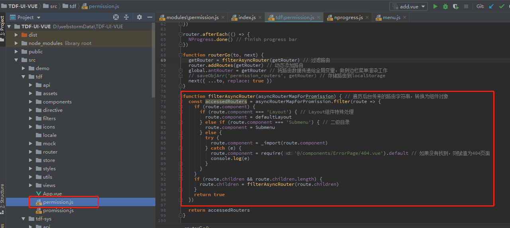
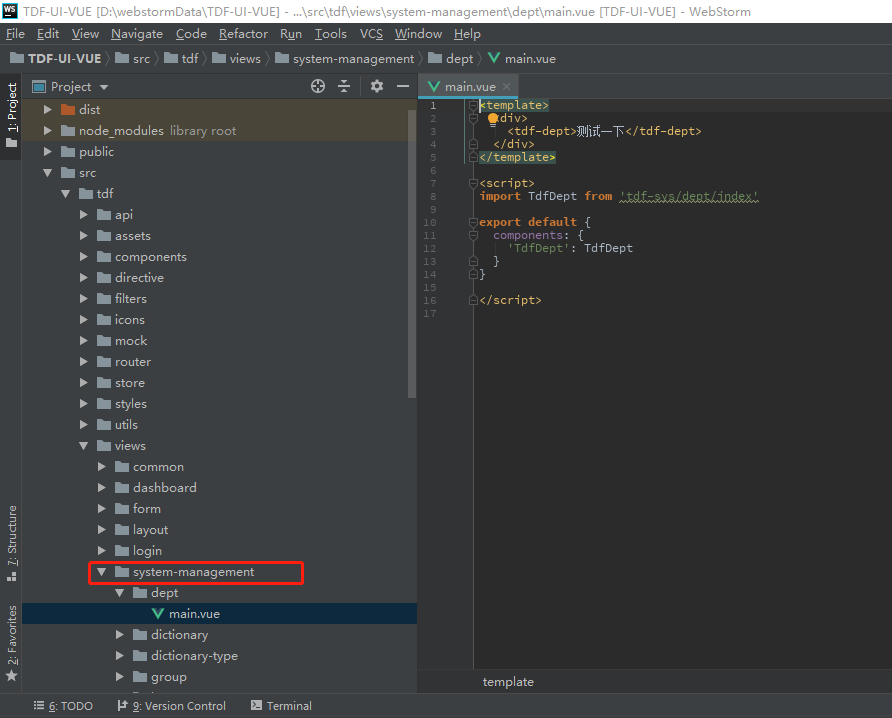
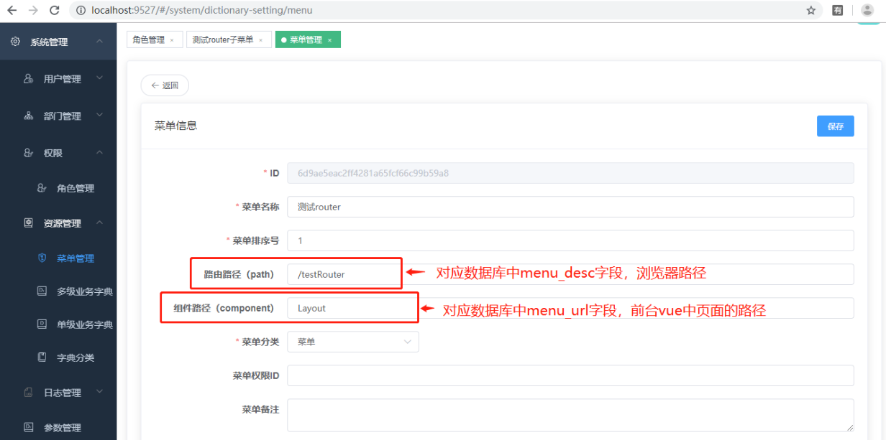
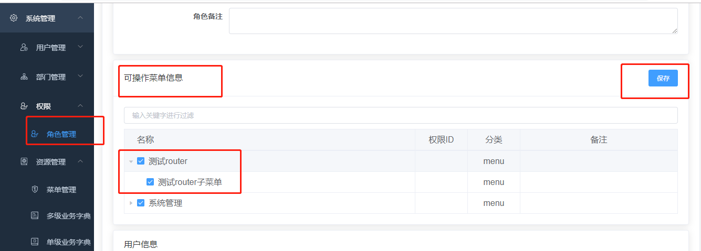
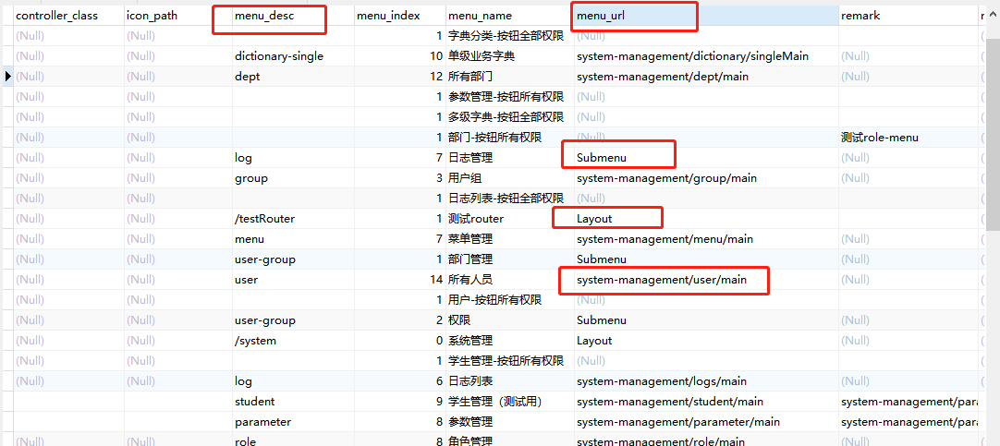

# 常见问题-router（路由）从后台获取，使用过程中注意事项

## 1.简单介绍

vue项目实现**动态路由**的方式大体可分为两种:
**1.前端这边把路由写好，登录的时候根据用户角色权限来动态展示路由(前端控制路由)**

**2.后台传来当前用户对应权限的路由表，前端通过调接口拿到后处理(后端处理路由)**

TDF项目在前后台分离后，目前使用的是第二种方式，tdf路由router也经历过两个主要的阶段阶段，

第一阶段，前后台分离后，router的内容由前后台共同配置，前台保留一份router内容，后台保存一份，同时后台对路由的权限进行控制，当前台请求时，后台将权限配置提交给前台，由前台决定哪些需要展示，这样带来一个缺点就是同样的数据需要前后台都需要保存一份，前台数据需要同步到后台，比较麻烦，给开发带来一些问题，

第二阶段，这时，tdf对路由进行了进一步的改造，将路由的所有内容转移到了后台，由后台提供router的内容和权限控制，方便前后台进行解耦。我们通常使用的tdf为该版本，也推荐使用该版本。但很多部门同事对router的配置和使用有疑问，该文章对此进行解答和补充。

## 2.前后台交互逻辑

首先前台配置后台请求接口：如下图中/system/menu/query-allTree-ForRouter为请求的controller路径


后台会提供给前台如下格式的json数据：

```json
{
  "code" : 1,
  "message" : "操作成功",
  "data" : {
    "router" : [ {
      "parentId" : null,
      "path" : "",
      "component" : "Layout",
      "hidden" : null,
      "alwaysShow" : null,
      "name" : null,
      "meta" : null,
      "children" : [ {
        "parentId" : null,
        "path" : "/index",
        "component" : "tdf/views/dashboard/index",
        "hidden" : null,
        "alwaysShow" : null,
        "name" : null,
        "meta" : {
          "index" : "1",
          "roles" : [ ],
          "title" : "TDF",
          "icon" : "index",
          "cacheAble" : false
        },
        "children" : null,
        "index" : 0,
        "id" : null
      } ],
      "index" : 0,
      "id" : "be87d0711de047efaffeef3c123b7f30"
    }]
  }
}
```

因为后端传回来的都是**字符串格式**的，但是前端这里需要的是一个组件对象，需要写一个方法遍历一下，将字符串转换为组件对象：



**例如：将后端传回的"component": "Layout", 转为"component": Layout组件对象，如下面代码所示**

```js
//遍历后台传来的路由字符串，转换为组件对象
if (route.component === 'Layout') { // Layout组件特殊处理
  route.component = defaultLayout
} else if (route.component === 'Submenu') { // 二级目录
  route.component = Submenu
} else {
  try {
    route.component = _import(route.component)
  } catch (e) {
    route.component = require('@/components/ErrorPage/404.vue').default // 如果没有找到，则赋值为404页面
    console.log(e)
  }
}
```

## 3.如何使用-配置router

router是路由管理器，如果对router了解不是特别多的同学可以先参考官方文档：https://router.vuejs.org/zh/guide/#html
TDF中，我们构建主要是单页应用，在原有基础上，假设我们想新增一个模块，我们首先需要在vue前台源码中增加页面
 
假设新页面新增在如图中文件夹下，然后我们需要新建一条router数据，指向该页面，
 
如图所以，需要在菜单下新增一条菜单数据，其中路由路径对应的为后台menu表数据中的menu_desc字段，该字段对应的是浏览器中路径，组件路径对应的是后台menu表中的menu_url字段，该字段对应的为我们刚刚新增的页面的路径，注意，如果是一级菜单，路由路径前需要加上”/“，一级菜单下需要由子菜单才可以显示，新增菜单后，我们需要在权限管理处勾选菜单权限，如图所示：
 
如果各项设置正常，刷新页面后，新增路径即可在前台展示。
在数据库中，menu表中，menu_url字段中，一级菜单需要设置为”Layout”，二级菜单设置为”Submenu”,真正指向页面的菜单，如前面所说，需要指向views路径下页面的路径。
 