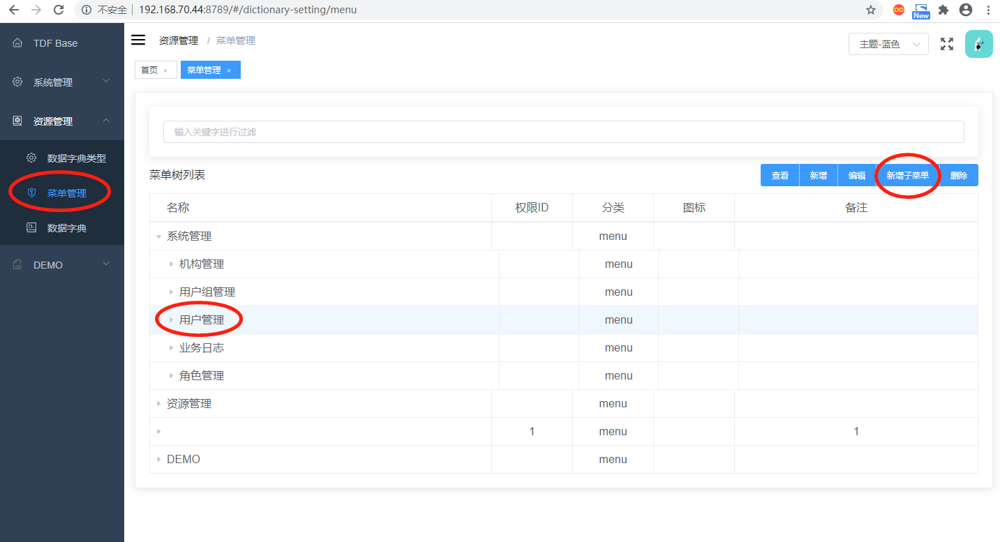
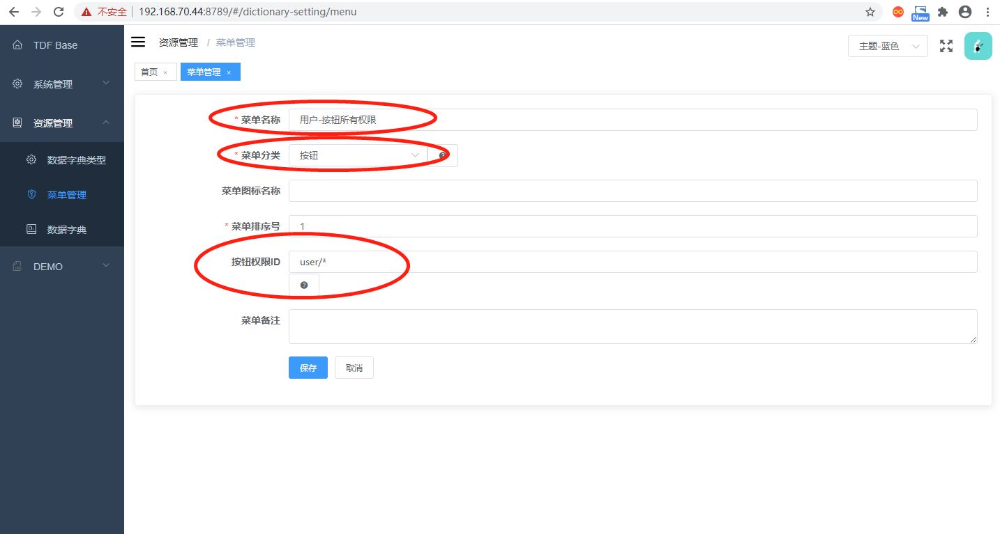
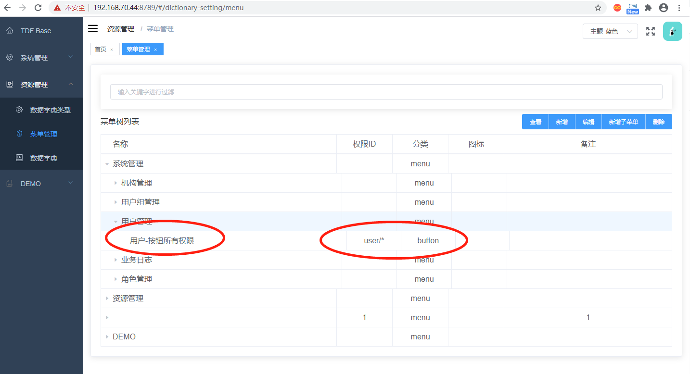
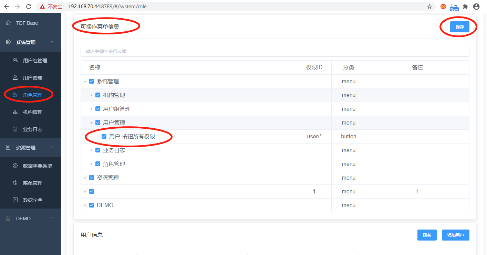
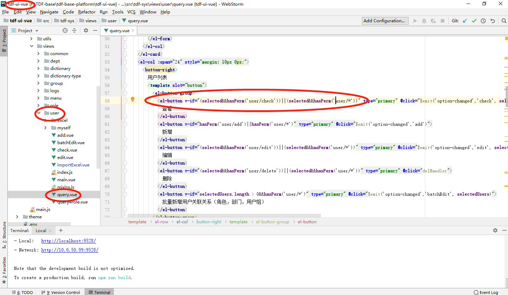
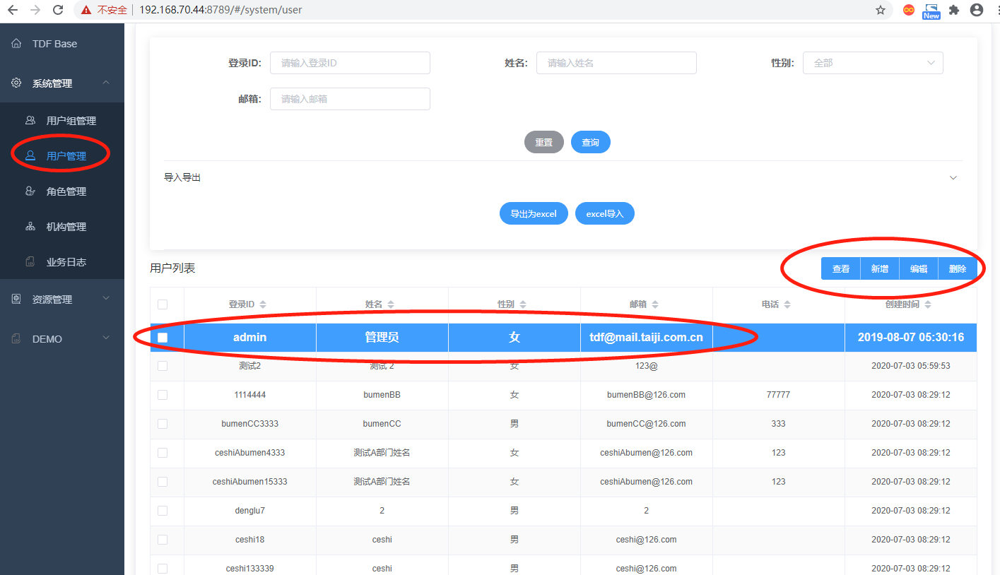

# 常见问题-页面中按钮权限的开发和配置

页面中常常会涉及到某些按钮需要一定权限才可以看到或者控制，在tdf项目中，按钮权限使用的是将按钮设置称为该菜单的子菜单的模式，从而对该子菜单进行角色的权限配置。例如拿用户页面为例：

## 1.第一步：新增按钮权限子菜单

首先进入菜单管理页面，点击相应的页面菜单（例如用户中所有人员菜单），选择右上方的“新增子菜单”按钮，进入到新增页面

在新增页面，如下配置：其中按钮权限id需要前后台开发人员协商制定，这里选择页面按钮的所有权限，使用user/*来表示。点击保存。

保存成功后会在该菜单下查找到刚刚添加的子菜单。

## 2.第二步：给按钮子菜单分配角色权限

按钮子菜单新增成功后，进入到角色管理页面，对该按钮子菜单分配权限，

## 3.第三步在页面开发过程中，添加按钮相应配置

同时，前台在开发的过程中，对相应的按钮进行配置，如下图中，用户页面，查看、新增、编辑等按钮配置成为勾选并且有权限才可以访问。其中v-if="(selected&&hasPerm('user/check'))||(selected&&hasPerm('user/*'))"代表按钮的权限的配置。

其中(selected&&hasPerm('user/*'))中的user/*就是我们刚刚在按钮子菜单中刚刚配置的按钮权限id，这个由前后台的开发人员共同商议确定。

## 4.结果

当以上步骤都配置成功后，我们点开用户页面，就可以看到相应的页面按钮的显示或者隐藏。

