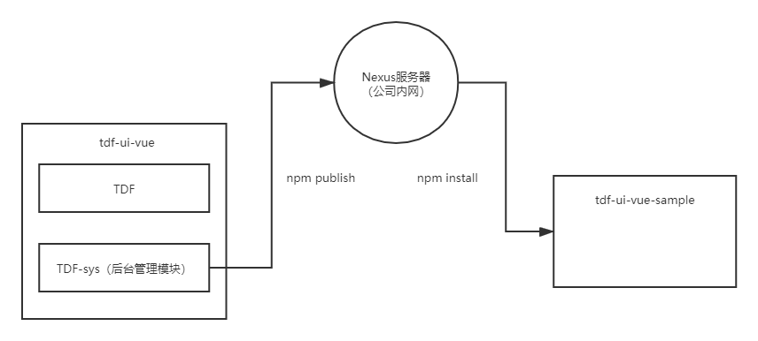

## 1.TDF前端项目整体介绍

​      目前，TDF前端项目共分为两个子工程，一个为tdf-ui-vue（工程1），一个为tdf-ui-vue-sample（工程2），其中工程1为源码工程，同时工程一通过npm打包后，为工程2提供后台管理的模块，工程2通过npm install引入模块，工程的图解如下




​		其中后台管理模块包含的功能主要有：人员管理，用户组管理，机构管理，权限管理，菜单管理，模块化的主要目的有：通过模块化将后台管理部分代码和业务代码隔离，如果项目中有对后台管理定制化开发比较多的部分，则建议选用tdf-ui-vue项目进行源码开发，如果对已有后台管理部分功能已经满足需求，则可以选用tdf-ui-vue-sample项目进行开发，后续后台管理部分有代码更新，可以用npm install的形式进行更新，以免通过git形式有merge冲突的情况。

## 2.项目源代码目录层次介绍


```
|-- tdf-ui-vue-sample
	|-- node_modules // 引入模块
    |-- public
        |-- config  
            |-- dynamicConfig.js // 部署配置文件
        |-- favicon.ico       // favicon图标
        |-- index.html        // html模板
    |-- theme                 // 主题配置文件
    |-- src                   // 源代码
    	|-- assets            // 主题配置文件
        |-- main.js           // 入口文件
        |-- demo              // sample样例
                |-- api
                   |-- student.js   //student接口
                |-- views      //student页面
        |-- tdf
            |-- App.vue        // 入口页面
            |-- permission.js  // 权限管理-路由管理           
            |-- api            // 后台接口请求方法
            |-- assets         // 主题、字体等静态资源
            |-- components     // 全局公用组件
            |-- directive      // 全局指令
            |-- filters        // 全局filter
            |-- icons          // 项目所有的svg icons
            |-- mock           // 项目mock模拟数据
            |-- router         // 路由
            |-- store          // 全局store管理
            |-- styles         // 全局样式
            |-- utils          // 全局公用方法
            |-- views          // view展示页面
    |-- .env					//环境变量配置
    |-- .env.development        //环境变量配置  development模式
    |-- .env.production         //环境变量配置  production模式
    |-- .gitignore              //git忽略项
    |-- babel.config.js         //babel配置
    |-- package.json            //package.json
    |-- README.md               //README.md
    |-- vue.config.js           //webpack扩展配置-代理配置等
```
## 3.拦截器介绍

```
  async error => {
    if (error && error.response) {
      switch (error.response.status) {
        case 401:// 登陆失效后，后台返回401错误，根据401错误引导重新登录
          var tmpToken = store.getters.token
          if (!tmpToken) {
            tmpToken = Cookies.get('USER_TOKEN')
          }
          if (tmpToken.refresh_token) {
            await refreshToken(tmpToken.refresh_token).then(data => {
              store.dispatch('LoginByOauth', data.data).then(location.reload())// 为了重新刷新出刚才失败的接口)
            })
          } else {
            console.info('dengchu else-------------')
            MessageBox.confirm('你已被登出，可以取消继续留在该页面，或者重新登录', '确定登出', {
              confirmButtonText: '重新登录',
              cancelButtonText: '取消',
              type: 'warning'
            }).then(() => {
              store.dispatch('FedLogOut').then(() => {
                location.reload() // 为了重新实例化vue-router对象 避免bug
              })
            })
            error.message = '登陆失效'
          }
          break
        case 500:
          error.message = '服务器错误(500)'
          break
      }
    }
    Message({
      message: error.message,
      type: 'error',
      duration: 3 * 1000
    })
    return Promise.reject(error)
  }
```

## 4.配置文件-vue.config.js介绍

`vue.config.js` 是一个可选的配置文件，如果项目的 (和 `package.json` 同级的) 根目录中存在这个文件，那么它会被 `@vue/cli-service` 自动加载。你也可以使用 `package.json` 中的 `vue` 字段，但是注意这种写法需要你严格遵照 JSON 的格式来写。

这个文件应该导出一个包含了选项的对象：

```js
// vue.config.js
module.exports = {
  // 选项...
}
```

### 4.1publicPath

- Type: `string`

- Default: `'/'`

  部署应用包时的基本 URL。用法和 webpack 本身的 `output.publicPath` 一致，但是 Vue CLI 在一些其他地方也需要用到这个值，所以**请始终使用 `publicPath` 而不要直接修改 webpack 的 `output.publicPath`**。

  默认情况下，Vue CLI 会假设你的应用是被部署在一个域名的根路径上，例如 `https://www.my-app.com/`。如果应用被部署在一个子路径上，你就需要用这个选项指定这个子路径。例如，如果你的应用被部署在 `https://www.my-app.com/my-app/`，则设置 `publicPath` 为 `/my-app/`。

  这个值也可以被设置为空字符串 (`''`) 或是相对路径 (`'./'`)，这样所有的资源都会被链接为相对路径，这样打出来的包可以被部署在任意路径，也可以用在类似 Cordova hybrid 应用的文件系统中。

  相对 publicPath 的限制

  相对路径的 `publicPath` 有一些使用上的限制。在以下情况下，应当避免使用相对 `publicPath`:

  - 当使用基于 HTML5 `history.pushState` 的路由时；
  - 当使用 `pages` 选项构建多页面应用时。

  这个值在开发环境下同样生效。如果你想把开发服务器架设在根路径，你可以使用一个条件式的值：

  ```js
  module.exports = {
    publicPath: process.env.NODE_ENV === 'production'
      ? '/production-sub-path/'
      : '/'
  }
  ```

在本项目中配置为

```
publicPath: isProduction ? './' : '/', // 基本路径
```

如果是生产环境为相对路径，这样打包可以部署在任意路径

### 4.2outputDir

- Type: `string`

- Default: `'dist'`

  当运行 `vue-cli-service build` 时生成的生产环境构建文件的目录。注意目标目录在构建之前会被清除 (构建时传入 `--no-clean` 可关闭该行为)。

  提示

  请始终使用 `outputDir` 而不要修改 webpack 的 `output.path`。

### 4.3lintOnSave

- Type: `boolean` | `'warning'` | `'default'` | `'error'`

- Default: `'default'`

  是否在开发环境下通过 [eslint-loader](https://github.com/webpack-contrib/eslint-loader) 在每次保存时 lint 代码。这个值会在 [`@vue/cli-plugin-eslint`](https://github.com/vuejs/vue-cli/tree/dev/packages/%40vue/cli-plugin-eslint) 被安装之后生效。

  设置为 `true` 或 `'warning'` 时，`eslint-loader` 会将 lint 错误输出为编译警告。默认情况下，警告仅仅会被输出到命令行，且不会使得编译失败。

  如果你希望让 lint 错误在开发时直接显示在浏览器中，你可以使用 `lintOnSave: 'default'`。这会强制 `eslint-loader` 将 lint 错误输出为编译错误，同时也意味着 lint 错误将会导致编译失败。

  设置为 `error` 将会使得 `eslint-loader` 把 lint 警告也输出为编译错误，这意味着 lint 警告将会导致编译失败。

  或者，你也可以通过设置让浏览器 overlay 同时显示警告和错误：

  ```js
  // vue.config.js
  module.exports = {
    devServer: {
      overlay: {
        warnings: true,
        errors: true
      }
    }
  }
  ```

  当 `lintOnSave` 是一个 truthy 的值时，`eslint-loader` 在开发和生产构建下都会被启用。如果你想要在生产构建时禁用 `eslint-loader`，你可以用如下配置：

  ```js
  // vue.config.js
  module.exports = {
    lintOnSave: process.env.NODE_ENV !== 'production'
  }
  ```

### 4.4productionSourceMap

- Type: `boolean`

- Default: `true`

  如果你不需要生产环境的 source map，可以将其设置为 `false` 以加速生产环境构建。

### 4.5parallel

- Type: `boolean`

- Default: `require('os').cpus().length > 1`

  是否为 Babel 或 TypeScript 使用 `thread-loader`。该选项在系统的 CPU 有多于一个内核时自动启用，仅作用于生产构建。

### 4.6runtimeCompiler

- Type: `boolean`

- Default: `false`

  是否使用包含运行时编译器的 Vue 构建版本。设置为 `true` 后你就可以在 Vue 组件中使用 `template` 选项了，但是这会让你的应用额外增加 10kb 左右。

  更多细节可查阅：[Runtime + Compiler vs. Runtime only](https://cn.vuejs.org/v2/guide/installation.html#运行时-编译器-vs-只包含运行时)。

### 4.7chainWebpack

- Type: `Function`

  是一个函数，会接收一个基于 [webpack-chain](https://github.com/mozilla-neutrino/webpack-chain) 的 `ChainableConfig` 实例。允许对内部的 webpack 配置进行更细粒度的修改。

  更多细节可查阅：[配合 webpack > 链式操作](https://cli.vuejs.org/zh/guide/webpack.html#链式操作-高级)

  ```
  chainWebpack: config => {
    config.resolve.alias
      .set('@svg', resolve('./src/tdf/icons/svg'))
      .set('@', resolve('src/tdf'))
      .set('@folder-outside-request', resolve('src/tdf/utils'))// request的路径，为了动态配置模块中请求地址
      .set('@folder-inside-views-common', resolve('src/tdf-sys/views/common/mixins'))// 页面的配置
      .set('@folder-inside-utils', resolve('src/tdf-sys/utils'))// utils的路径-模块内部
      .set('@src', resolve('src'))// 根路径
      .set('tdf-sys', resolve('src/tdf-sys'))// 模块路径
    config.module.rules.delete('svg') // 重点:删除默认配置中处理svg,
    // 关闭 npm run build时 webpack性能提示
    config.performance
      .set('hints', false)
    // const svgRule = config.module.rule('svg')
    // svgRule.uses.clear()
    config.module
      .rule('svg-sprite-loader')
      .test(/\.svg$/)
      .include
      .add(resolve('src/tdf/icons/svg')) // 处理svg目录
      .end()
      .use('svg-sprite-loader')
      .loader('svg-sprite-loader')
      .options({
        symbolId: 'icon-[name]'
      })
    // config.performance
    //     .maxEntrypointSize(400000)
    //     .maxAssetSize(400000)
    //   生产环境配置
    if (isProduction) {
      // 删除预加载
      config.plugins.delete('preload')
      // 开启压缩代码
      config.optimization.minimize(true)
      // 分割代码
      config.optimization.splitChunks({
        chunks: 'all'
      })
    }
  },
  ```

### 4.8configureWebpack

- Type: `Object | Function`

  如果这个值是一个对象，则会通过 [webpack-merge](https://github.com/survivejs/webpack-merge) 合并到最终的配置中。

  如果这个值是一个函数，则会接收被解析的配置作为参数。该函数既可以修改配置并不返回任何东西，也可以返回一个被克隆或合并过的配置版本。

  更多细节可查阅：[配合 webpack > 简单的配置方式](https://cli.vuejs.org/zh/guide/webpack.html#简单的配置方式)

```
// webpack配置
configureWebpack: config => {
  config.entry.app = ['@babel/polyfill', './src/main.js']
  if (isProduction) {
    config.plugins.push(
      new UglifyJsPlugin({
        // 删除console warning
        uglifyOptions: {
          compress: {
            warnings: false,
            drop_debugger: true,
            drop_console: true
            // pure_funcs: ['console.log'] // 移除console
          }
        },
        sourceMap: false,
        // 使用多进程并行来提高构建速度
        parallel: true
      })
    )
  } else {
    //    测试环境
  }
},
```

### 4.9css.requireModuleExtension

- Type: `boolean`

- Default: `true`

  默认情况下，只有 `*.module.[ext]` 结尾的文件才会被视作 CSS Modules 模块。设置为 `false` 后你就可以去掉文件名中的 `.module` 并将所有的 `*.(css|scss|sass|less|styl(us)?)` 文件视为 CSS Modules 模块。

  提示

  如果你在 `css.loaderOptions.css` 里配置了自定义的 CSS Module 选项，则 `css.requireModuleExtension` 必须被显式地指定为 `true` 或者 `false`，否则我们无法确定你是否希望将这些自定义配置应用到所有 CSS 文件中。

  更多细节可查阅：[配合 CSS > CSS Modules](https://cli.vuejs.org/zh/guide/css.html#css-modules)

### 4.10css.extract

- Type: `boolean | Object`

- Default: 生产环境下是 `true`，开发环境下是 `false`

  是否将组件中的 CSS 提取至一个独立的 CSS 文件中 (而不是动态注入到 JavaScript 中的 inline 代码)。

  同样当构建 Web Components 组件时它总是会被禁用 (样式是 inline 的并注入到了 shadowRoot 中)。

  当作为一个库构建时，你也可以将其设置为 `false` 免得用户自己导入 CSS。

  提取 CSS 在开发环境模式下是默认不开启的，因为它和 CSS 热重载不兼容。然而，你仍然可以将这个值显性地设置为 `true` 在所有情况下都强制提取。

### 4.11css.sourceMap

- Type: `boolean`

- Default: `false`

  是否为 CSS 开启 source map。设置为 `true` 之后可能会影响构建的性能。

### 4.12css.loaderOptions

- Type: `Object`

- Default: `{}`

  向 CSS 相关的 loader 传递选项。例如：

  ```js
  module.exports = {
    css: {
      loaderOptions: {
        css: {
          // 这里的选项会传递给 css-loader
        },
        postcss: {
          // 这里的选项会传递给 postcss-loader
        }
      }
    }
  }
  ```

  支持的 loader 有：

  - [css-loader](https://github.com/webpack-contrib/css-loader)
  - [postcss-loader](https://github.com/postcss/postcss-loader)
  - [sass-loader](https://github.com/webpack-contrib/sass-loader)
  - [less-loader](https://github.com/webpack-contrib/less-loader)
  - [stylus-loader](https://github.com/shama/stylus-loader)

  另外，也可以使用 `scss` 选项，针对 `scss` 语法进行单独配置（区别于 `sass` 语法）。

  更多细节可查阅：[向预处理器 Loader 传递选项](https://cli.vuejs.org/zh/guide/css.html#向预处理器-loader-传递选项)

  提示

  相比于使用 `chainWebpack` 手动指定 loader 更推荐上面这样做，因为这些选项需要应用在使用了相应 loader 的多个地方。

```
// css 配置相关
css: {
  // 是否使用css分离插件 ExtractTextPlugin 生产环境下是true,开发环境下是false
  extract: true,
  // 是否开启 CSS source maps 方便开发人员的错误定位 true打包时间大大增加
  sourceMap: false,
  // css预设器配置项
  loaderOptions: {
    // sass:{
    //     data:`
    //         @import "@/styles"
    //     `
    // }
  },
  // 启用 CSS modules for all css / pre-process.or files
  requireModuleExtension: true
},
```

### 4.13devServer

- Type: `Object`

  [所有 `webpack-dev-server` 的选项](https://webpack.js.org/configuration/dev-server/)都支持。注意：

  - 有些值像 `host`、`port` 和 `https` 可能会被命令行参数覆写。
  - 有些值像 `publicPath` 和 `historyApiFallback` 不应该被修改，因为它们需要和开发服务器的 [publicPath](https://cli.vuejs.org/zh/config/#baseurl) 同步以保障正常的工作。

### 4.14devServer.proxy

- Type: `string | Object`

  如果你的前端应用和后端 API 服务器没有运行在同一个主机上，你需要在开发环境下将 API 请求代理到 API 服务器。这个问题可以通过 `vue.config.js` 中的 `devServer.proxy` 选项来配置。

  `devServer.proxy` 可以是一个指向开发环境 API 服务器的字符串：

  ```js
  module.exports = {
    devServer: {
      proxy: 'http://localhost:4000'
    }
  }
  ```

  这会告诉开发服务器将任何未知请求 (没有匹配到静态文件的请求) 代理到`http://localhost:4000`。

  如果你想要更多的代理控制行为，也可以使用一个 `path: options` 成对的对象。完整的选项可以查阅 [http-proxy-middleware](https://github.com/chimurai/http-proxy-middleware#proxycontext-config) 。

  ```js
  module.exports = {
    devServer: {
      proxy: {
        '/api': {
          target: '<url>',
          ws: true,
          changeOrigin: true
        },
        '/foo': {
          target: '<other_url>'
        }
      }
    }
  }
  ```

```
devServer: {
  open: process.platform === 'darwin',
  host: '0.0.0.0',
  port: 9527, // 页面访问端口号
  https: false,
  hotOnly: false,
  // 查阅 https://github.com/vuejs/vue-doc-zh-cn/vue-cli/cli-service.md#配置代理
  proxy: {
    '/api': {
      // 目标 API 地址  需要代理的服务器
      target: 'http://localhost:7779/',
      // 如果要代理 websocket
      ws: true,
      // 将主机标头的原点更改为目标URL 是否允许跨域
      changeOrigin: true,
      pathRewrite: {
        '^/api': ''// 这里理解成用'/api'代替target里面的地址,比如我要调用'http://40.00.100.100:3002/user/add'，直接写'/api/user/add'即可
      }
    }
  }
}
```

## 5.路由router介绍

​		目前TDF的路由是通过后台接口获取然后生成的，路由的权限和排序控制也都是在后台进行控制，后台根据当前登录用户，获取用户的角色，通过角色获取到用户有权限控制的菜单，最后排序后生成路由提供给前台。