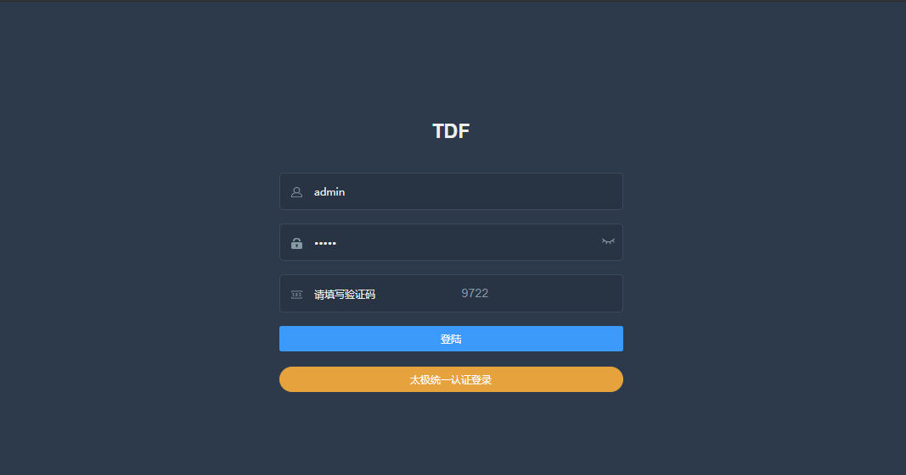

# 登录流程

输入前端地址（本地测试地址）：http://localhost:9527/ ，进入到登录页


该页面会请求后台的验证码接口http://localhost:7779/captcha，获取验证码，验证码超时后需要点击验证码区域更新验证码。输入用户名，密码后，点击登录按钮，进行登录，请求如下接口:http://localhost:7779/auth ,前端代码位置在：/src/tdf/api/login.js中：


```
export function loginByUsername(data) {
  return request({
    url: '/auth',
    method: 'post',
    data
  })
}
```

通过该接口，将用户名、密码、验证码传给后台，如果全部正确，后台会返回前台如下数据：{"code":200,"message":"操作成功","data":"BaseJwtToken80023F7F3F92DCF66807EB95AA8E0368BC1965542B72258DEF1F8DA556C3323FF4B097AE45E7E24C48071ED9C655D5DA8D829E2281D836AB516C89261A669900169AE1C75EE5F3BA67B68A4A97194E51446C218D46634CC771982D51C205AD4F66CE47C50AB0F772F9275873CF4DFC0F951668D3468DF6C7F5744C019F684898C7271A180B775C47A3D086E7A60FA7AD30FFDCB9EEA9AFE1847C44003D890AD5143BE13F043944CA1000850C792189301522E94D3FB12E01602F520187EBF26DCEDBB84D204A3C5CA9A9815CA61C3357A2AA85CD49066D51F93A67BFEAEB900DD27ED9C4CF272563AFC2AA36A9516DB76A190530E17A7B1D2EA0EA59B0456A9331124B9BB35392660B681B789BCD7B084A346AE47CED8FE9FCE36AB109207F8891EB9E4772EDF2D2B8DC865F3C71D99AC19245C2643FF312"}

其中，data中是token数据，前台保存token数据后，为了后续请求使用，其中token暂时使用cookie进行保存。

​		登录成功后，后续的每一次请求，如果接口是后台需要校验登录权限的，那每次使用token，TDF中使用axios进行接口的请求和拦截，TDF中对axios进行了简单的封装，对request和response做了拦截处理，简要流程如下：创建一个axios实例，其中process.env.VUE_APP_BASE_API在.env.development、.env.production中进行配置：

```
const service = axios.create({
  retry: 2,
  baseURL: process.env.NODE_ENV === 'development' ? process.env.VUE_APP_BASE_API : window.__config.VUE_APP_BASE_API,
  timeout: 50000, // request timeout, 接口返回等待的时间
  retryDelay: 1000 // 再次请求间隔时间
})
```

axios实例创建好之后，开始使用request拦截器对axios请求配置做统一处理，具体如下：