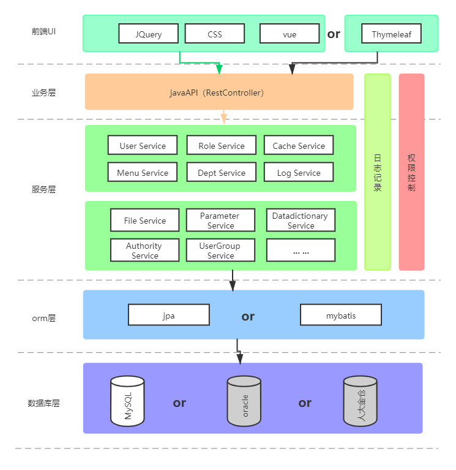

# 技术架构
## 技术路线
 
~~~
总体技术框架：Spring Boot（截至2020年5月14日，推荐使用2.1.14版本）
开发工具：不限制，如sts/eclipse/idea等
插件：lombok
构建工具：maven（推荐使用3.6.0以上版本）
代码管理工具：git
数据库：mysql、oracle、人大金仓（推荐mysql8）、PgSql等
~~~

## 基础框架

~~~
表现层：VUE、HTML5、CSS、Jquery、Thymeleaf、Bootstrap
接口层：Swagger2
控制层：Spring MVC
业务逻辑层：Spring Core、AOP等
持久层：Spring Data JPA ，mybatis
~~~

## 核心组件

~~~
缓存：Redis等
安全认证：Spring Security
日志：SLF4J、Log4j、Logback
~~~

