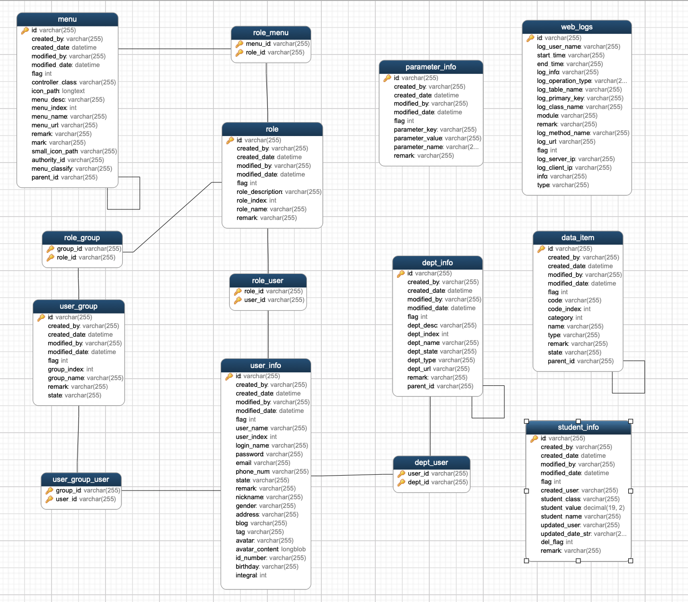

# 系统设计

## 模块简介

| 业务模块 | 一级子模块       | 二级子模块         |    功能描述            |
| -------- | ------------ | -----------------|------------------- |
| 系统管理 | 用户管理	  | 用户组           | 用户组信息维护   |
|		   |			  | 所有人员         | 人员信息维护   |
|		   | 部门管理	  | 所有部门         | 部门信息维护       |
|		   | 权限管理	  | 角色管理         | 角色信息维护       |
|          | 日志管理	  | 日志列表         |                    |
|          | 参数管理	  |                  |	参数维护				  |
| 资源管理 | 菜单管理     |           |  菜单数据维护                  |
|          | 多级业务字典 |  |          多级业务字典维护          |
|          | 单级业务字典 |  |        单级业务字典维护            |
|          | 字典分类 |  |            字典分类维护        |
| DEMO     | 学生管理     |                  |  Demo示例   |

## 模块设计

主要提供用户-用户组-部门-角色-菜单-字典等数据的管理（增删改查-关联关系等），如图：

 

图解

>创建一个用户，可以将用户关联到用户组、角色、部门上，角色和菜单相关联，决定用户是否有菜单查看管理的权限（例如参数，字典，日志等）

