# 用户手册

## 1.简介

用户手册主要对tdf项目进行整体的介绍，同时用图片的形式对操作指南加以说明，快速开始和常见问题等请参照相关章节

## 2.操作指南

共分几个模块来讲解：登陆，用户，部门，用户组，角色，菜单，数据字典，日志，demo

### 2.1.登陆

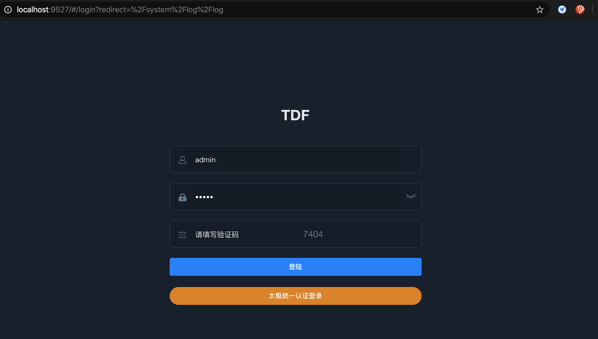 

如图，登陆共分为两种方式：

第一种：普通登陆方式，使用用户名密码（测试版本默认用户名：admin，密码：admin），普通登陆中存在验证码校验，该校验过程为前后台交互式，如果在测试阶段，为了方便测试，想去掉后台验证码校验过程，需要在tdf-sample-jwt后台项目中修改相应配置，如下图：
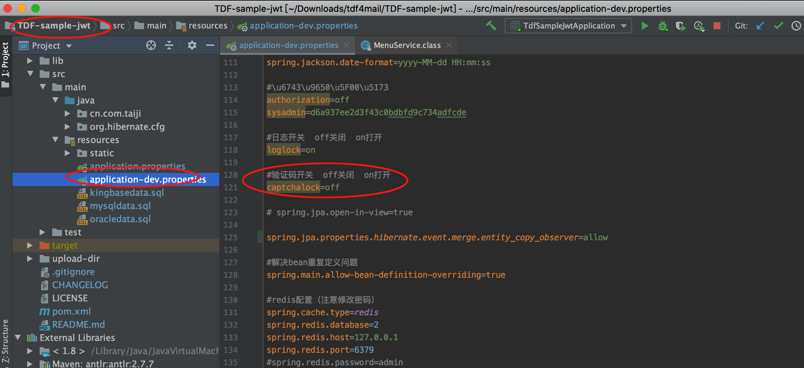 

将图中配置设为off即可关闭后台验证码校验，此时在验证码处随意输入字符即可。

第二种：使用太极统一认证登陆，进入到太极统一认证登陆页面，输入太极邮箱及相应密码进行登录，默认分配为普通用户权限（角色为ROLE_USER）

### 2.2.用户操作

登陆完成后，首先进入到用户列表页面，如下图，在页面中我们可以看到用户列表，在点击某一用户后，会出现右上方的增删改查按钮。表示对改用户进行相应操作，我们逐一进行操作实验
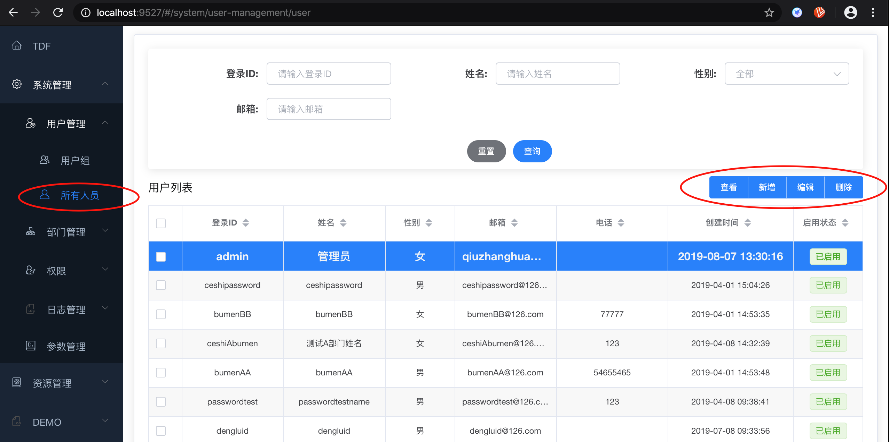 

#### 2.2.1.用户操作-查看

点击查看按钮，进入到查看用户页面，页面中显示用户的基本信息和用户分组，用户部门，用户角色信息

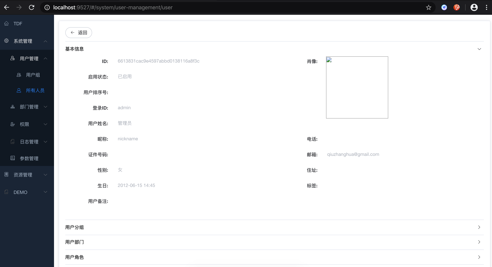 

#### 2.2.2.用户操作-新增

点击新增按钮，进入到新增 页面，页面中带*号字段为必填字段，如未填写，会有相应提示，如下图

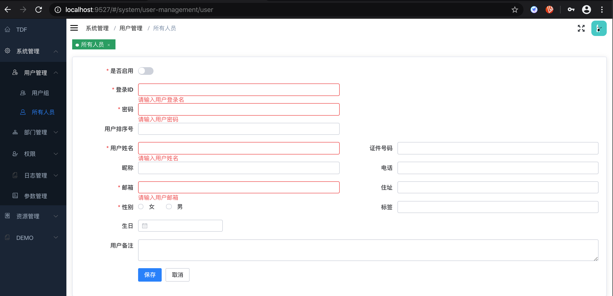 

如果填写的登陆id为已有id，也会给予相应提示：如下图

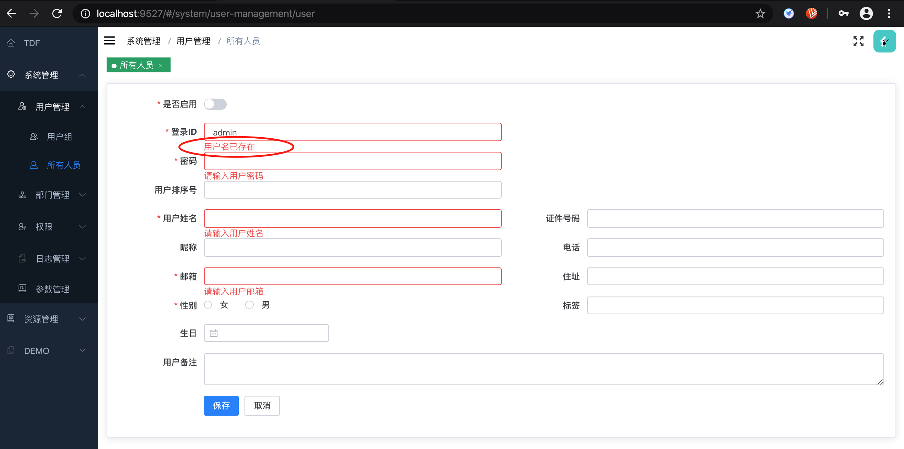 

保存成功后，会自动进入到用户编辑页面：

#### 2.2.3.用户操作-编辑

编辑页面从上到下，如下面两图所示，分为几个部分：1，用户信息修改；2，用户密码修改；3，用户分组、部门、角色修改，分别加以说明

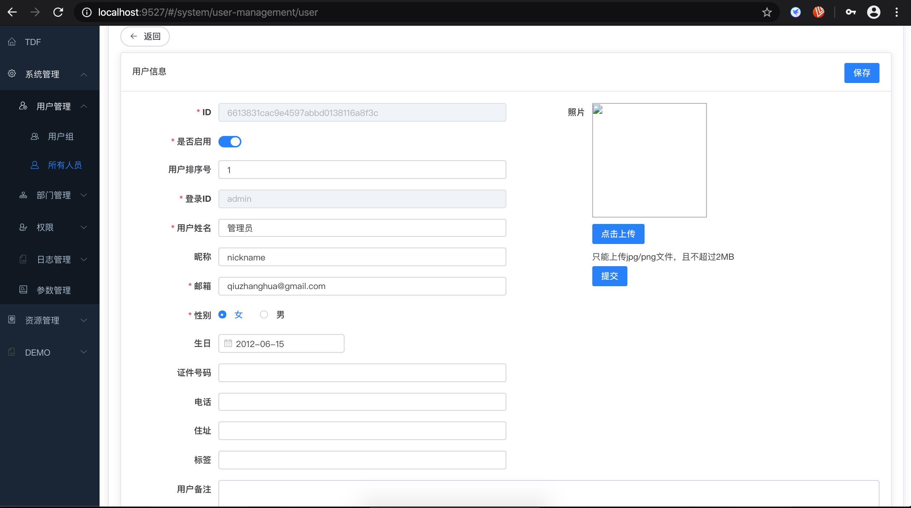 
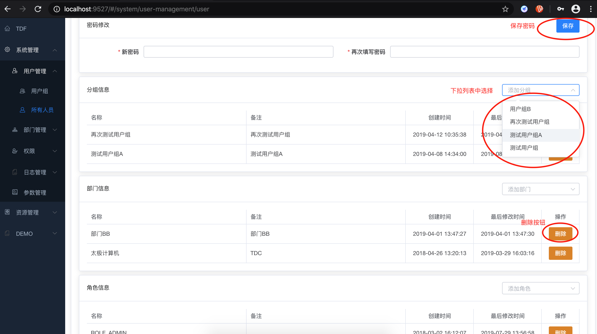 

如图所示：

用户信息修改，只需在相应字段修改为需要的信息，点击右上方保存即可，

用户密码修改，填充新密码，并再次确认密码保存即可

用户分组、角色、部门信息的修改，在相应右侧下拉列表中选择需要的分组、角色、部门，点击即可，删除操作只需要点击删除按钮即可。

#### 2.2.4.用户操作-删除

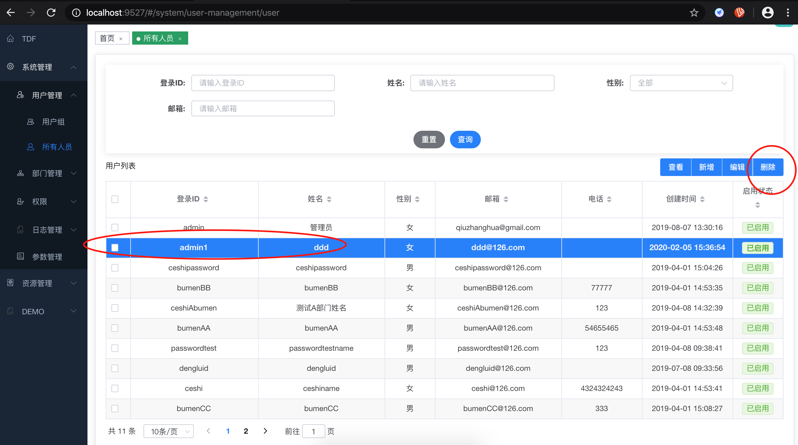 

最后是用户删除操作，点击选中需要删除的用户，点击右上方的删除按钮即可。

### 2.3.菜单操作

因为菜单和角色操作比较关键，所以这里先讲解菜单以及角色的操作。先简介菜单的操作，因为在常见问题模块中-讲到按钮权限操作是通过设置子菜单并且配置角色权限的形式实现的，所以按钮也是菜单的一种，目前菜单中主要分为两种类型，一种是我们常见的菜单，一种是按钮（如图），一种为特殊的外链形式的菜单。先以菜单为例：
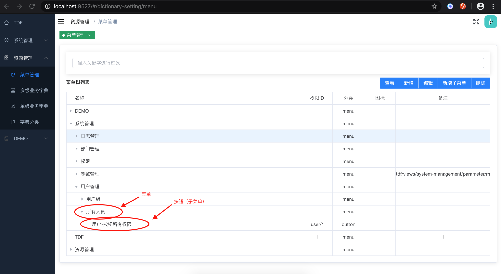

#### 2.3.1.菜单操作-菜单

我们以在系统管理下增加子菜单为例，进行增删改查操作指南。
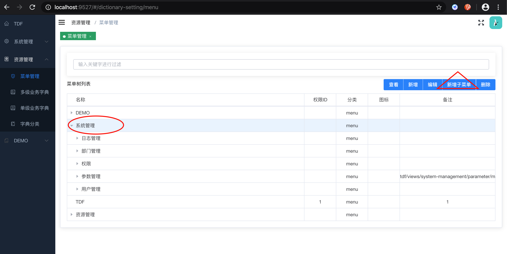

如图，如果想在某一个菜单下增加子菜单，则先点击该菜单，然后选择右上方的“新增子菜单”按钮，如果想新增和系统管理平级的一级菜单，则直接点击右上方的“新增”按钮。点击新增子菜单后，出现新增页面，如下图：
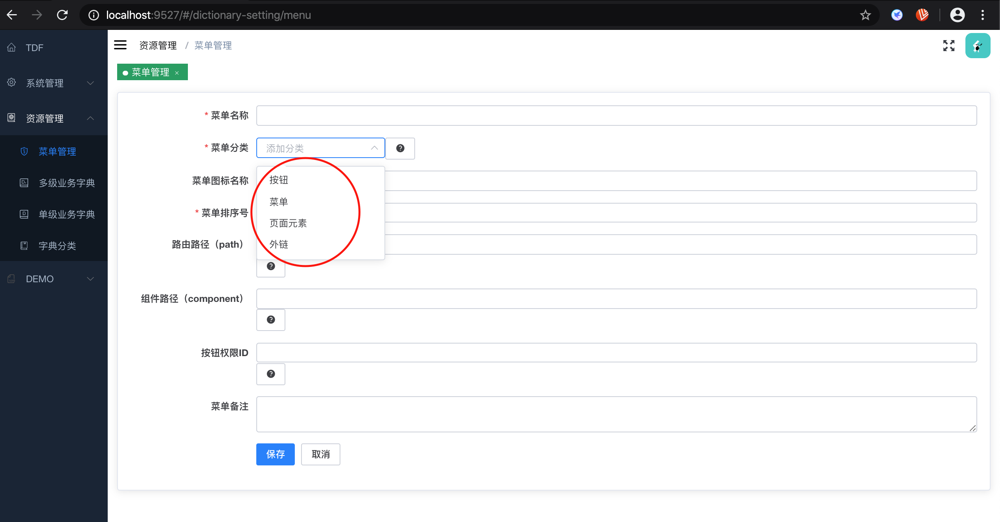

这里我们在下拉列表中选择菜单类型，选择后，出现以下页面：

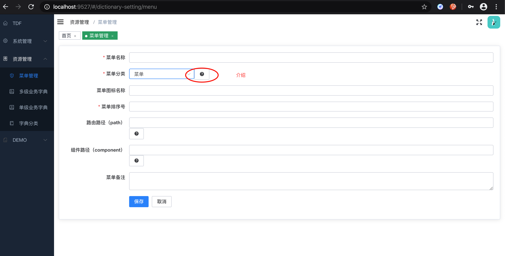

其中红圈问号处，鼠标点击会出现相应选项的介绍，对各个字段一一介绍：
菜单名称-就是菜单显示的名称；
菜单分类-此处我们选择菜单类型，相应还有按钮和外链类型，下面我们会一一介绍；
菜单图标名称-这个由前端项目中给定，稍后会优化此处为下拉列表形式；
菜单排序号-为菜单显示的先后顺序；
路由路径（path）-这里填写的为浏览器中显示路径，一级菜单需要添加'/'，如果是第三方外链，需要加http或者https前缀；
组件路径（component）-是菜单指向的前端页面的地址，
菜单备注-为菜单的其他需要说明的内容，

这里对路由路径（path）和组件路径（component）分别以图片的形式加以详细说明：先以路由路径（path）为例：
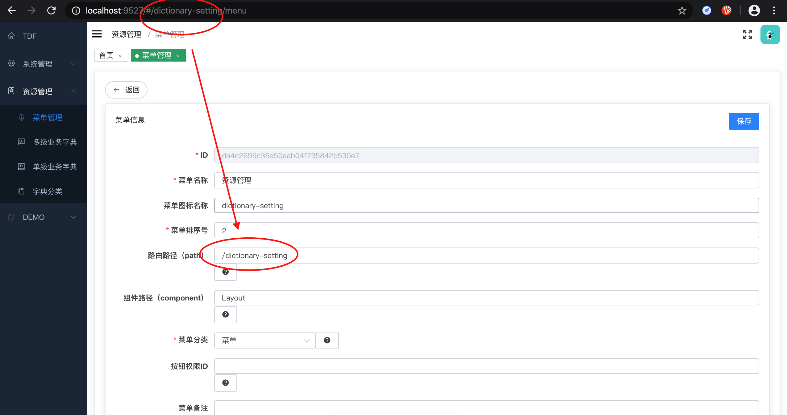
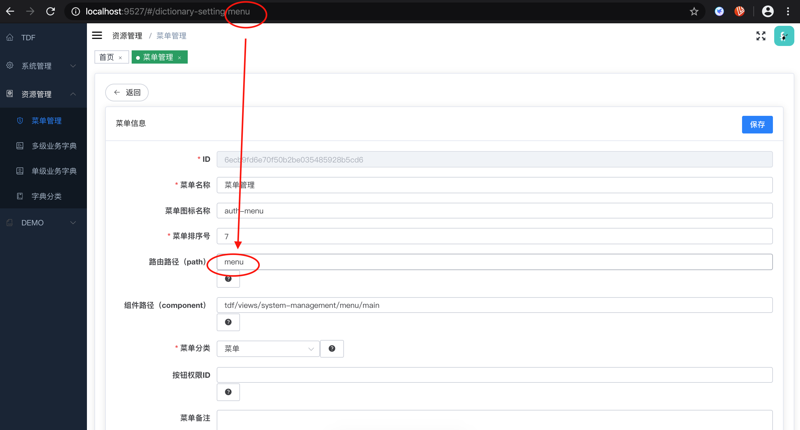

上面两图中，我们选择菜单管理为例，说明path应该如何填写，菜单管理的上一级菜单为资源管理，在资源管理菜单新增时，path处填写为/dictionary-setting，因为资源管理是一级菜单，所以按照规范，我们在最前面添加了“/”符号，然后菜单管理菜单新增时，我们在path处填写menu，一级菜单加上二级菜单，两个path组合，成为最终的浏览器访问的路径/dictionary-setting/menu。

接下来说明component，按照规范一级菜单需要填写为”Layout”，二级菜单填写为”Submenu”,如下两图

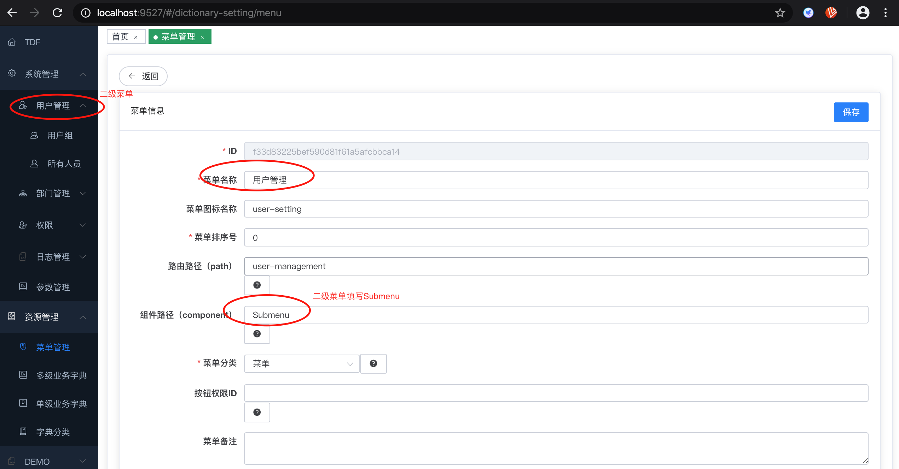

如果是直接指向页面的菜单，则填写页面的地址，如下面图中所示：
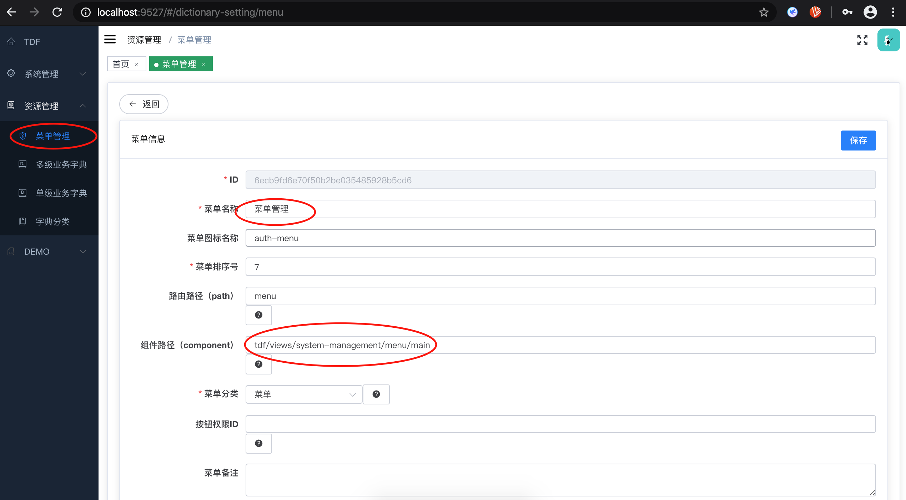

则component中填写的应该是前端开发过程中负责显示的页面地址，如下图：

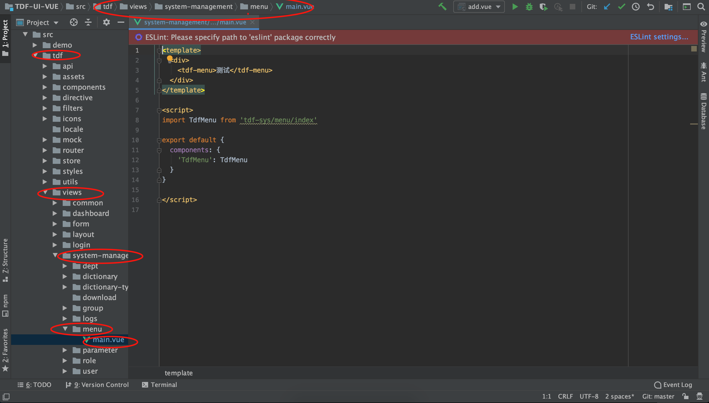

#### 2.3.2.菜单操作-按钮

上面讲解了菜单的具体字段如何填写，下面讲解作为按钮的子菜单如何创建。

页面中常常会涉及到某些按钮需要一定权限才可以看到或者控制，在tdf项目中，按钮权限使用的是将按钮设置称为该菜单的子菜单的模式，从而对该子菜单进行角色的权限配置。例如拿用户页面为例：

##### 1.第一步：新增按钮权限子菜单

首先进入菜单管理页面，点击相应的页面菜单（例如用户中所有人员菜单），选择右上方的“新增子菜单”按钮，进入到新增页面
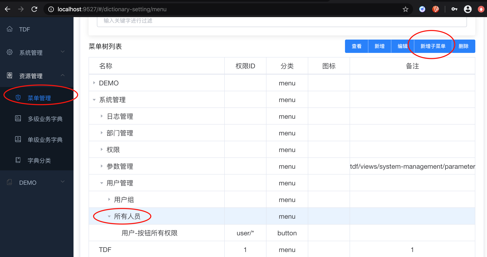

在新增页面，如下配置：其中按钮权限id需要前后台开发人员协商制定，这里选择页面按钮的所有权限，使用user/*来表示。点击保存。

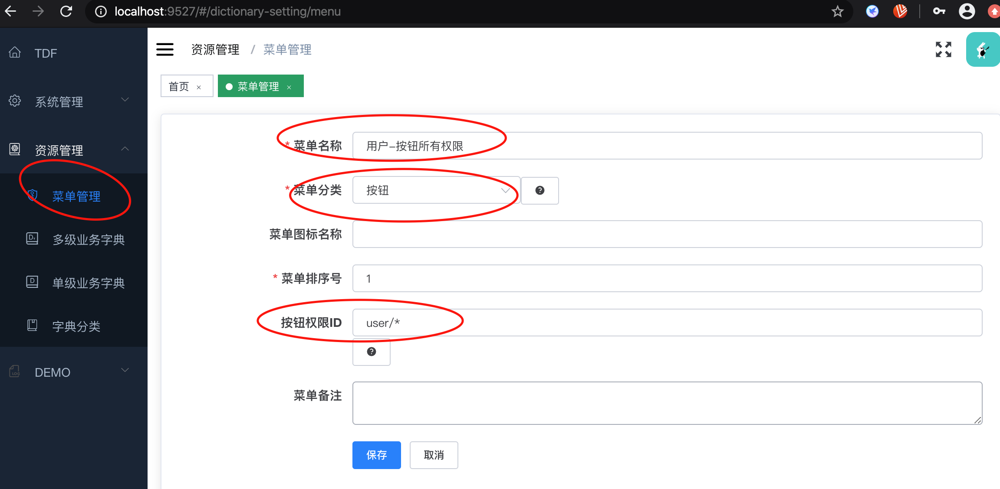

保存成功后会在该菜单下查找到刚刚添加的子菜单。

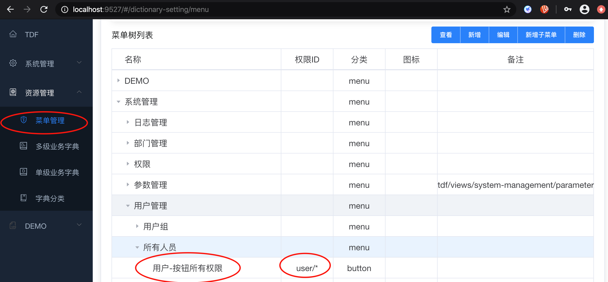

##### 2.第二步：给按钮子菜单分配角色权限

按钮子菜单新增成功后，进入到角色管理页面，对该按钮子菜单分配权限，
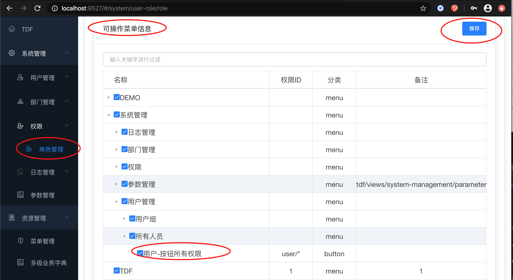

##### 3.第三步在页面开发过程中，添加按钮相应配置

同时，前台在开发的过程中，对相应的按钮进行配置，如下图中，用户页面，查看、新增、编辑等按钮配置成为勾选并且有权限才可以访问。其中v-if="(selected&&hasPerm('user/check'))||(selected&&hasPerm('user/*'))"代表按钮的权限的配置。

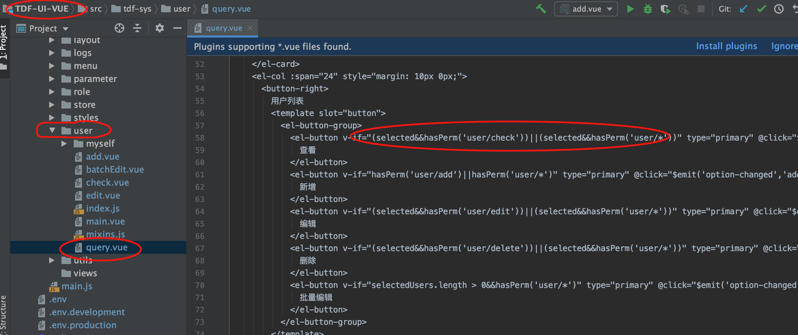

其中(selected&&hasPerm('user/*'))中的user/*就是我们刚刚在按钮子菜单中刚刚配置的按钮权限id，这个由前后台的开发人员共同商议确定。

##### 4.结果

当以上步骤都配置成功后，我们点开用户页面，就可以看到相应的页面按钮的显示或者隐藏。

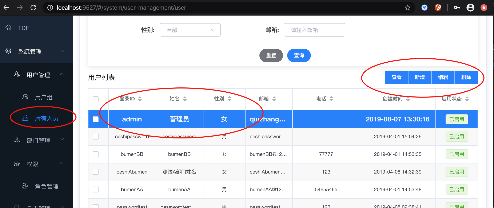

#### 2.3.3.菜单操作-外链

在开发过程中，我们也会用到一些外链，比如第三方链接或者已有链接等，我们应该怎么创建这样的菜单，如下图：选择菜单分类下拉列表中的外链选项，然后在路由路径中填写相应的外链地址：例如：https://www.baidu.com，请注意此处一定要将http://或者https://前缀带上。
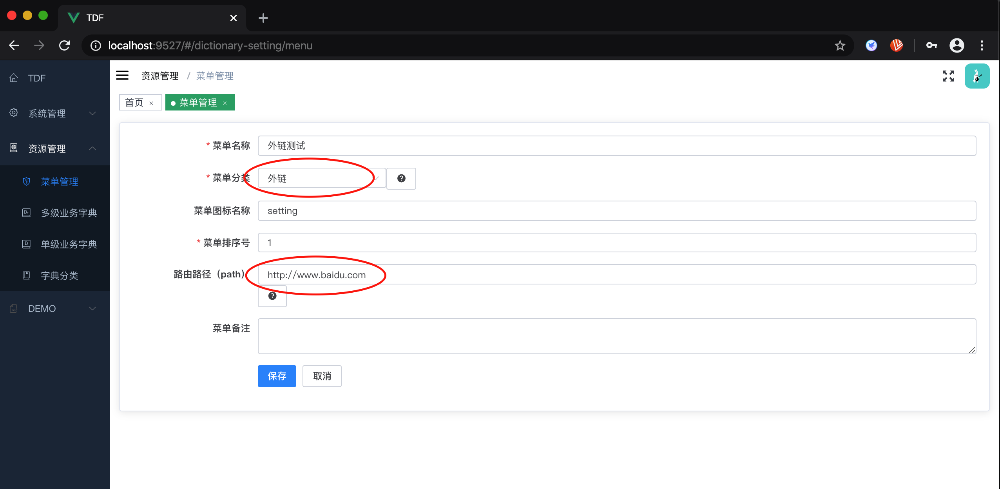

### 2.4.角色操作

因为在权限配置中，菜单和角色相关联比较密切，所以讲解完菜单，我们接着讲解角色的操作。

#### 2.4.1.角色操作-新增

如图所示，点击角色管理页面，进入到角色管理页面，点击右上方的新增按钮，进入到新增页面，填写相关信息。

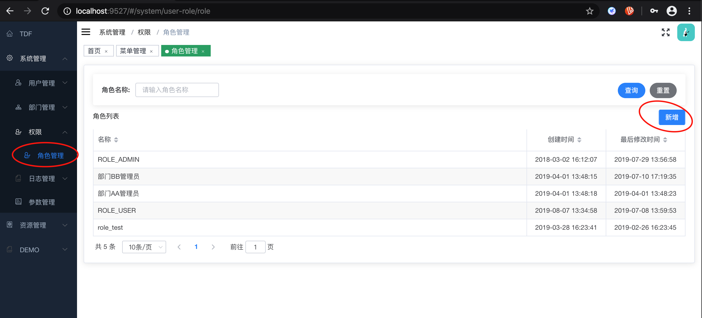
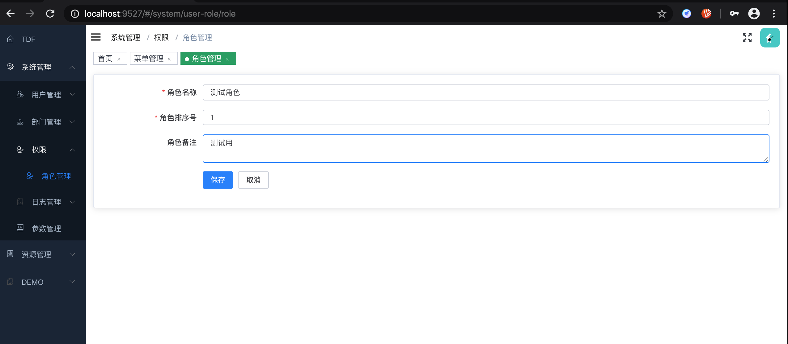

保存成功后，自动进入到角色编辑页面
#### 2.4.2.角色操作-编辑

编辑页面也分为上下两部分，上面一部分包括角色信息的修改和菜单权限的管理。

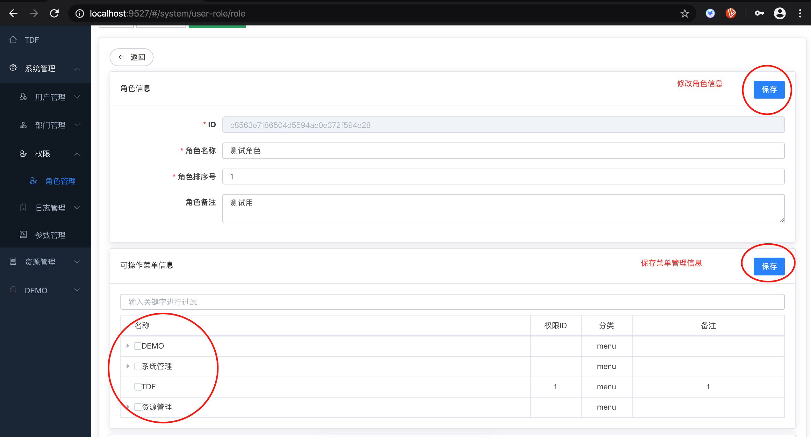

其中菜单权限的管理，勾选相应的菜单，保存后，可以使相应角色可以管理勾选的菜单，例如
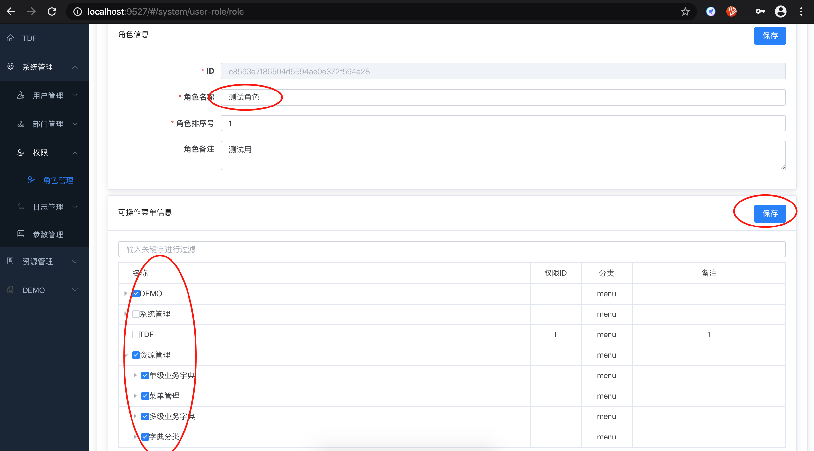

此时我们回到用户管理页面，将部分用户批量管理，给他们分配刚刚创建的角色：测试角色

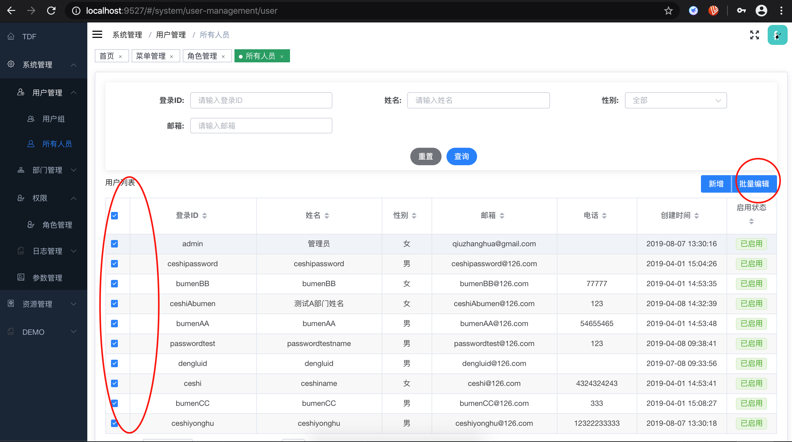

如上图所示，勾选多个用户，然后点击右上方批量管理，进入到批量管理页面，如下图，在下图中为上面的用户分配测试角色这个角色，保存后

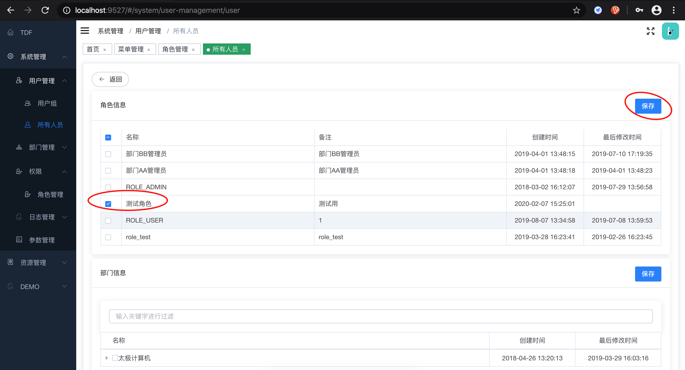

保存后，我们继续回到角色管理页面，进入到测试角色的编辑页面，看到我们刚刚勾选的菜单已经生效，同时刚刚给用户添加角色的操作也已经生效，我们选择其中一个用户进行测试，请注意查看测试用户是否还拥有其他角色，以免和测试期望不一致。

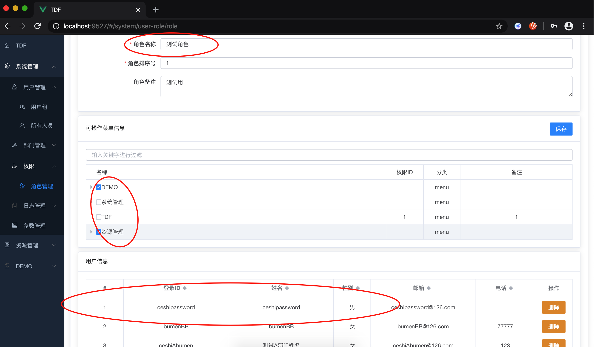

我们选择其中一个用户（测试）登陆，可以看到测试用户只能看到刚刚勾选的demo和资源管理菜单，其余的菜单没有管理权限。

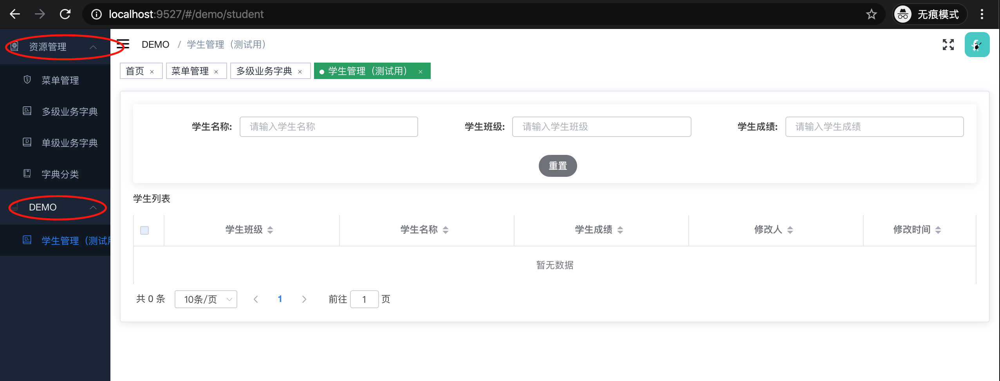

#### 2.4.3.角色操作-删除

进入角色管理页面，点击相应角色，然后选择右上方删除按钮删除即可。

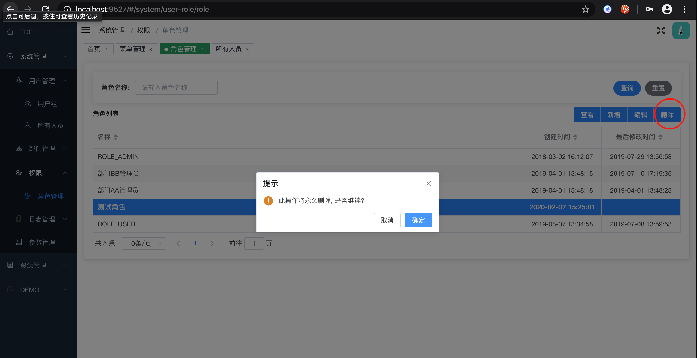