# TDF单体项目开发指南

## 以开发demo示例代码为例讲解开发指南

### 0.前言

##### 0.1.业务设计

​        开发指南以demo为例介绍前台后台的开发过程，demo代码是以学生数据为例开发的单表应用，其中学生的数据包括学生名字，成绩，班级，功能包括学生数据的增删改查，本文主要介绍相应代码的位置，开发流程，相应注意事项（前台：api接口位置，配置，浏览器兼容性问题等；后台：包括swagger接口规范，日志配置规范，security配置，数据字典的使用，如何获取当前登陆用户等）。


### 1.前台部分开发（默认使用master分支）

通过前面系统架构-模块组成中讲解，我们可以得知，tdf-ui-vue-sample前台项目结构，我们以学生管理demo为例讲解如何开发新模块。

##### 1.1.如图，创建一个student.js，其中代码为访问后台的增删改查接口。

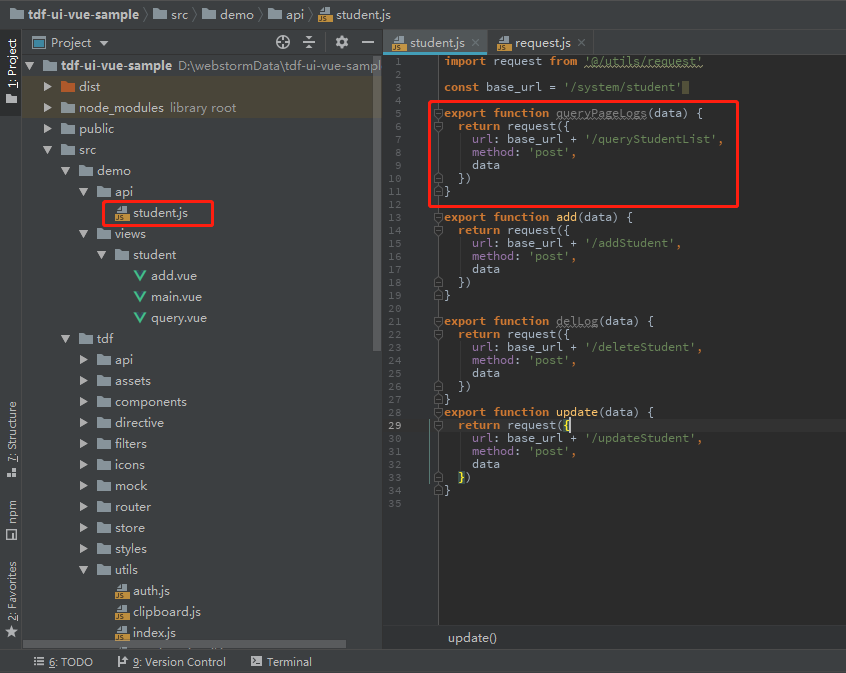 

代码如下：

```vue
import request from '@/utils/request'

const base_url = '/system/student'

export function queryPageLogs(data) {
  return request({
    url: base_url + '/queryStudentList',
    method: 'post',
    data
  })
}

export function add(data) {
  return request({
    url: base_url + '/addStudent',
    method: 'post',
    data
  })
}

export function delLog(data) {
  return request({
    url: base_url + '/deleteStudent',
    method: 'post',
    data
  })
}
export function update(data) {
  return request({
    url: base_url + '/updateStudent',
    method: 'post',
    data
  })
}
```

##### 1.2.同时，创建学生查询页面，如图位置：

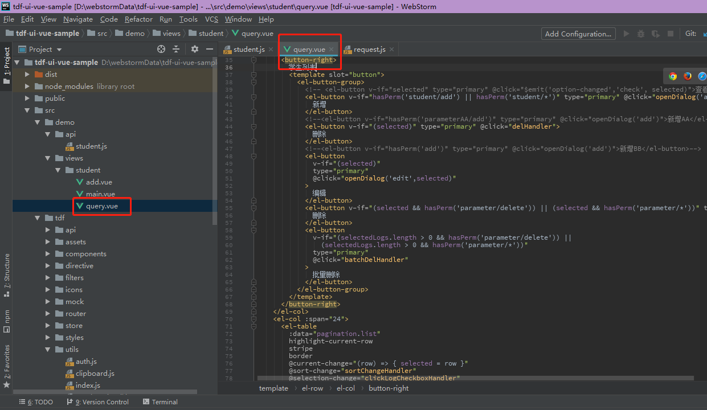 

##### 1.3.创建菜单并赋予当前用户（以admin用户为例）学生菜单的访问权限

* 创建菜单
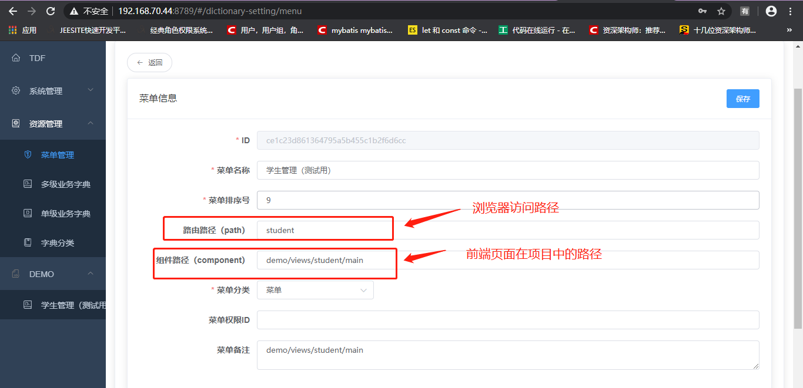 
* 分配权限
如下图所示
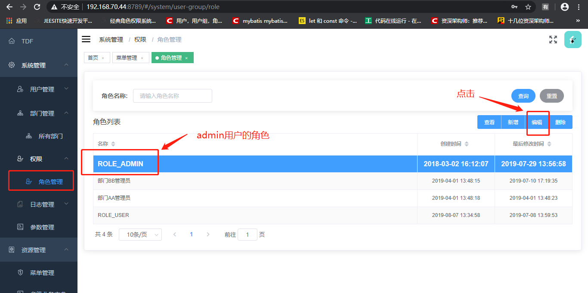
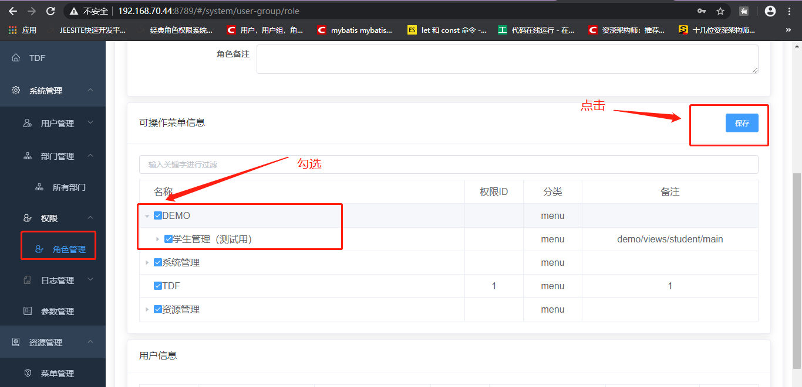
* 成功后，admin用户获得student菜单的访问权限

## 2.后台部分开发（默认使用master分支）

##### 2.1.如图所示，创建相应增删改查controller，创建相应服务层，实体等

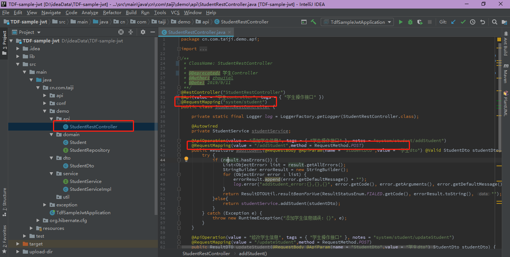

## 3.前后台启动和访问

##### 3.1.后台部分启动

右键启动工程

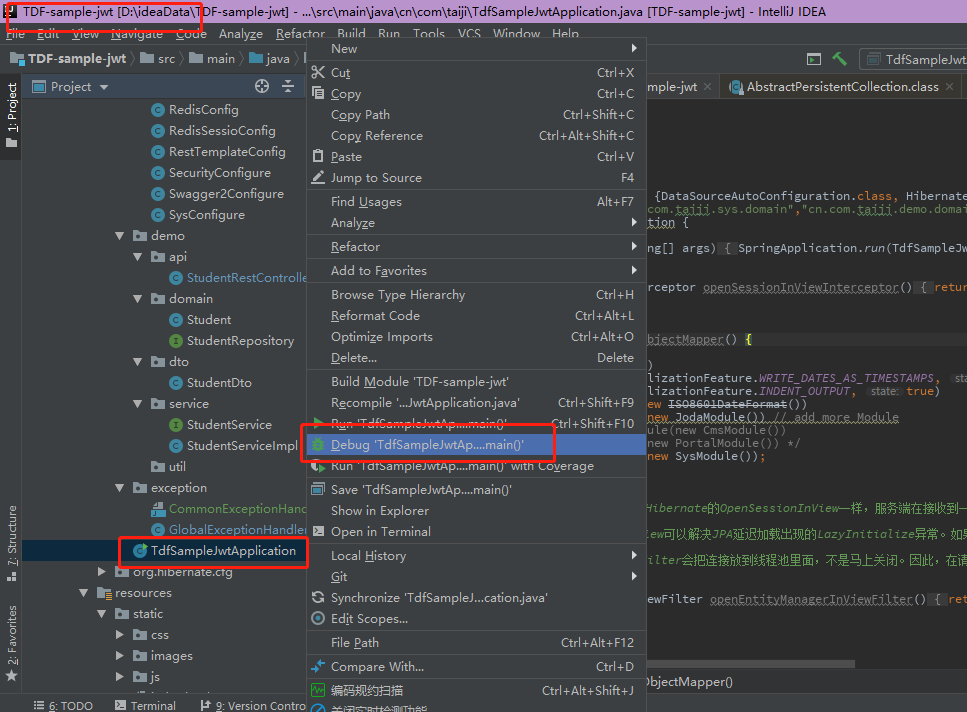

##### 3.2.前台部分启动

在前台命令行窗口中输入：npm run serve

##### 3.3.访问

全部启动成功后，访问localhost：9527，账号：admin 密码：admin 进行访问

## 4.展示示例（增删改查）

* 以上代码编写好后，重启前后台项目，展示新增功能
 
* 查询功能
  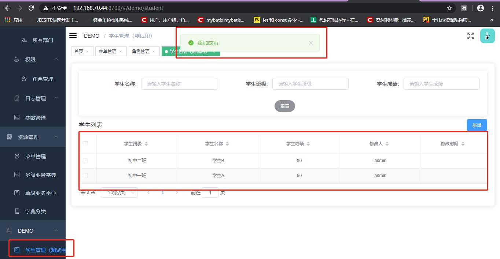 

## 5.前端开发规范和常见使用问题

##### 5.1.配置说明（参照注释）

```vue
# 后台接口请求地址
VUE_APP_BASE_API = http://localhost:7779/
# oauth2的请求授权地址
VUE_APP_OAUTH_userAuthorizationUri = http://192.168.99.77:9998/oauth/authorize
# oauth2的clientId
VUE_APP_OAUTH_clientId = tdfuivueTEST
# oauth2的client秘钥
VUE_APP_OAUTH_client_secret = tdfuivue
# oauth2的授权类型
VUE_APP_OAUTH_response_type = code
# oauth2的权限范围
VUE_APP_OAUTH_scope = user_info
# oauth2的临时状态码
VUE_APP_OAUTH_state =
# oauth2授权码类型的重定向地址
VUE_APP_OAUTH_redirect_uri = http://localhost:9527/ssologin
# oauth2的授权类型
VUE_APP_OAUTH_grant_type = authorization_code
# oauth2的获取token的url
VUE_APP_OAUTH_accessTokenUri = http://192.168.99.77:9998/oauth/token
# 利用token获取用户信息的url
VUE_APP_OAUTH_userInfoUri = http://192.168.99.77:9998/me
```

##### 5.2.模块化使用

###### 5.2.1.模块的引用

在前端tdf-ui-vue-sample项目中，菜单-用户-角色-部门等页面是通过npm模块化引用来进行调用接口和展示的，配置在图中位置，菜单-用户-角色-部门等页面是通过发布模块来供其他工程引用的，模块名为：tdf-ui-vue-tdfsys，引用时为了方便版本的控制，使用latest版本号，表示使用最后发布的版本。在版本更新后，需要执行npm install命令来更新包资源。

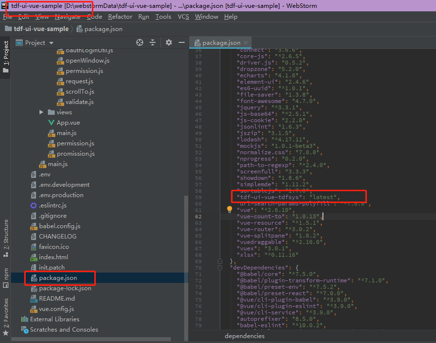

###### 5.2.2.模块的发布

如果想自己编写npm模块供其他项目使用，可以按照以下步骤实现。

因为npm服务器已经搭建配置好，所以只需要以下操作，

第一步：npm login 登录，依次输入用户名（user4npm），密码(user4npm))和邮箱(user4npm@126.com)，该用户已设置好权限。

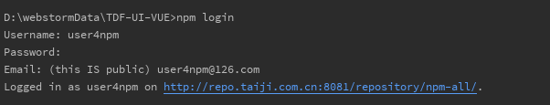

第二部：登录成功后，执行publish操作

npm publish --registry=http://repo.taiji.com.cn:8081/repository/npmPrivate/

##### 5.3.浏览器兼容性问题

待补充

## 6.后端开发规范和常见使用问题

##### 6.1.定制安全策略

因为安全验证使用jwt模式，所以在每次接口的请求中的head中必须放入token，token必须登录才可以获取，但其中有某些接口可能不需要登录就可以访问，那需要在以下位置进行设置。如图：

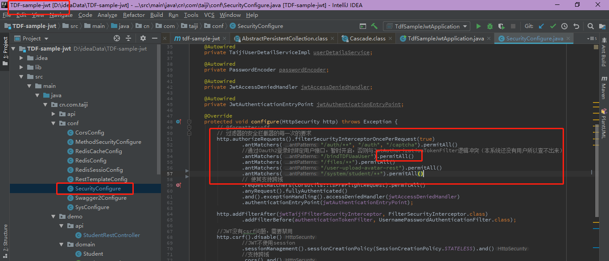

```java
添加以下语句
.antMatchers("/bindTDFUaaUser").permitAll()
```

其中permitall代表给/bindTDFUaaUser接口所有的权限，不需要登录就可以访问，如此设置后，/bindTDFUaaUser接口就可以不用登录就可以访问到。

##### 6.2.文件上传

待补充

##### 6.3.日志记录

待补充

##### 6.4.csrf

待补充

##### 6.5.swagger接口

在自己新开发接口的同时，因为前后台已经进行了分离，为了方便前后台的联调，后台开发完接口后，需要配置swagger的相关配置，方便后续前端开发人员调试接口，swagger的配置如下。

###### 6.5.1.关于配置的说明

| 作用范围 | API       | 使用位置         |
| -------- | ------------ | -----------------|------------------- |
| 协议集描述 | @Api   	  | 用在Conntroller类上           |
|	协议描述	   |	@ApiOperation		  | 用在controller方法上         |

###### 6.5.2.关于配置的使用

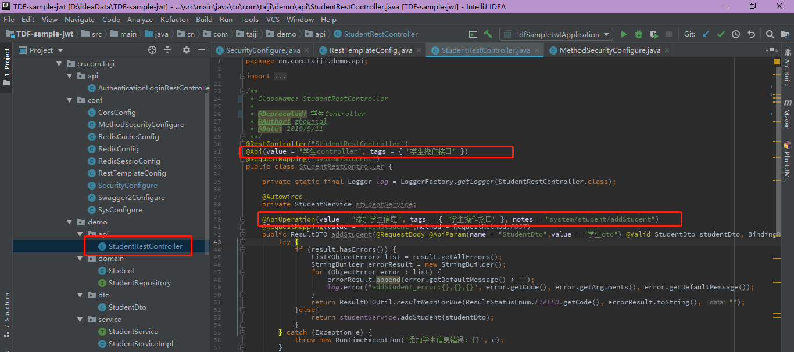

如图中所示：value是接口的描述，而相同的tags会在最终分配到同一个列表中，方便查看接口，如图：

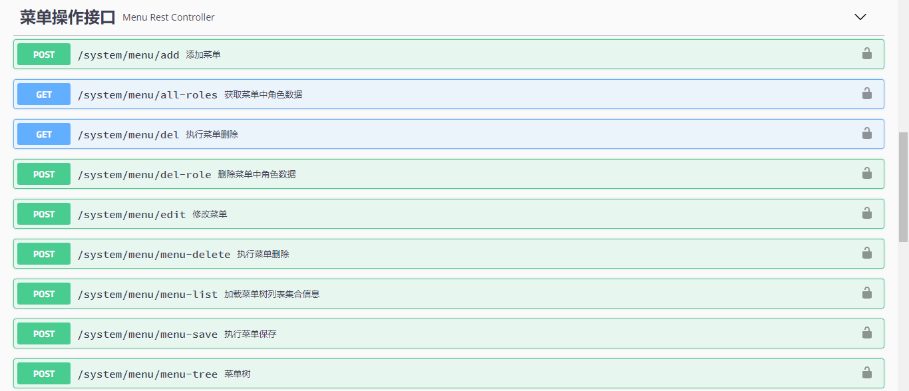

##### 6.6.数据字典的使用

待补充

##### 6.7.获取用户信息

在后台开发过程中，经常会用到当前登录用户信息的情况，一下代码可以获取当前登录用户信息。

```java
import com.hoioy.diamond.security.SecurityUtils;
final String userName = SecurityUtils.getCurrentLogin();
user = userService.findByLoginName(userName);
```


## 7.工作流组件（慧点）

待补充