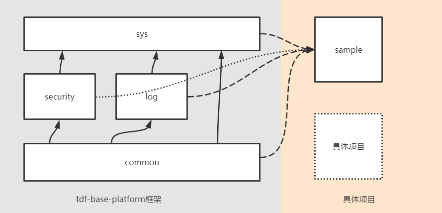

## 简介
tdf-base-platform示例后台开发工程，演示如何使用TDF BASE版本以Jar包依赖方式快速开发。


1. 看issue中的文档需求
1. 准备tdf-log和tdf-security开发示例，配合文档
1. 每个目录下注意下mybatis和jpa的区别
1. 1

### tdf-base-platform模块简介
其中tdf-base-platform是框架源码，基础模块有4个：
1. common：定义公共规范
1. security：定义安全、认证和鉴权规范
1. log：定义日志规范
1. sys；预置RBAC等基础业务逻辑

#### 分层调用关系图
 
实际项目根据需求，自由选择依赖模块。

#### common模块
common是TDF Base的核心、是核心规范的具体实现、是最重要的模块。
common有三个具体模块：
* tdf-common：Http接口层规范、统一异常规范、公共DTO、统一校验、缓存等等脱离JPA和Mybatis的规范
* tdf-common-jpa：依赖tdf-common，实现JPA特有的规范
* tdf-common-mybatis:依赖tdf-common，实现Mybatis特有的规范

##### 关键BaseXXX简介
BaseXXX系列代码在tdf-common模块，是各个层代码的一种约束，需要被继承。
* 持久层：BaseXXXDomain、IBaseXXXMapper、IBaseXXXRepository等
* 业务层：IBaseXXXService等
* Http接口层: BaseXXXController等 

##### 类关系图（请参考tdf-base-platform具体代码）


### tdf-sample模块简介
* tdf-ui-vue-sample：TDF Base基于tdf-ui-vue的前端示例。
* tdf-uniapp：TDF Base基于uniapp的移动H5示例。具备基本的登录、退出、个人信息、导航等功能。
* tdf-sys-sample-jpa:TDF Base使用jpa的示例
* tdf-sys-sample-mybatis:TDF Base使用mybatis的示例

### jpa或者mybatis简介
同时支持JPA或者Mybatis做为持久层:
* jpa依赖TDF-Base的以下包:

```xml
</dependency>
    <groupId>cn.com.taiji</groupId>
    <artifactId>tdf-log-jpa</artifactId>
</dependency>
<dependency>
    <groupId>cn.com.taiji</groupId>
    <artifactId>tdf-security-jwt</artifactId>
</dependency>
<dependency>
    <groupId>cn.com.taiji</groupId>
    <artifactId>tdf-sys-jpa</artifactId>
</dependency>
<dependency>
    <groupId>cn.com.taiji</groupId>
    <artifactId>tdf-sys-web</artifactId>
</dependency>
```

* mybatis依赖TDF-Base的以下包:

```xml
<dependency>
    <groupId>cn.com.taiji</groupId>
    <artifactId>tdf-log-mybatis</artifactId>
</dependency>
<dependency>
    <groupId>cn.com.taiji</groupId>
    <artifactId>tdf-security-jwt</artifactId>
</dependency>
<dependency>
    <groupId>cn.com.taiji</groupId>
    <artifactId>tdf-sys-mybatis</artifactId>
</dependency>
<dependency>
    <groupId>cn.com.taiji</groupId>
    <artifactId>tdf-sys-web</artifactId>
</dependency>
```

## 开发
### 开发单表业务
* 重点：BaseXXX、开发规范

#### 选择一个业务
模拟业务：学生与课程相关业务

#### 编写领域对象和DTO
学生；Student 具体参考tdf-sys-jpa-sample相关代码。注意继承 BaseDomain。不建议使用JPA外键、多表关联关系等注解。建议将领域对象“拉平”。

```java
public class Student extends BaseDomain
```

学生DTO；StudentDTO 具体参考tdf-sys-jpa-sample相关代码。注意继承 BaseDTO

```java
public class StudentDTO extends BaseDTO
```

#### 编写持久层
StudentRepository 具体参考tdf-sys-jpa-sample相关代码。注意继承 IBaseRepository

```java
public interface StudentRepository extends IBaseRepository<Student>
```

####  编写业务层
IStudentService 具体参考tdf-sys-jpa-sample相关代码。注意继承 IBaseService

```java
public interface IStudentService extends IBaseService<StudentDTO, Student>
```

StudentServiceImpl 具体参考tdf-sys-jpa-sample相关代码。注意继承 BaseServiceImpl，BaseServiceImpl 中提供了默认的实现，不满足需求时候用户可以Override。

```java
public class StudentServiceImpl extends BaseServiceImpl<StudentRepository, Student, StudentDTO> implements IStudentService
```

#### 编写Http接口层
StudentController 具体参考tdf-sys-jpa-sample相关代码。注意继承 BaseController，BaseController 中提供了默认的实现，不满足需求时候用户可以Override。

```java
public class StudentController extends BaseController<IStudentService, StudentDTO>
```

接口层统一返回ResultDTO。所有分页查询统一使用PageDTO

#### swagger测试 
1. 启动
1. 浏览器输入： `http://localhost:7779/doc.html`
1. 登录
    1. 点击'登录'接口、调试、输入：用户名/密码（admin/admin)获取token，形如：`BaseJwtToken80023F7F3F92D...(省略）`
    1. 复制token
    1. 点击Authorize模块，在参数值部分输入“Bearer "后再粘贴复制的token，也就是最终的token是"Bearer "+ token
1. 点击各个接口进行调试
1. 点击新增的学生接口进行调试

### 开发关联表业务
重点：BaseJoinXXX、多表关联分页、开发规范
上一步骤建立了学生Student相关类。课程Course请参考Student步骤或者tdf-sys-jpa-sample相关代码。下面建立“学生与课程关联表”

#### 编写领域对象和DTO
学生与课程关联表；CourseStudentScore 具体参考tdf-sys-jpa-sample相关代码。注意继承 BaseJoinDomain

```java
public class CourseStudentScore extends BaseJoinDomain 
```

学生与课程关联表DTO；CourseStudentScoreJoinDTO 具体参考tdf-sys-jpa-sample相关代码。注意继承 BaseJoinDTO

```java
public class CourseStudentScoreJoinDTO extends BaseJoinDTO 
```

#### 编写持久层
CourseStudentScoreRepository 具体参考tdf-sys-jpa-sample相关代码。注意继承 IBaseJoinRepository。注意多表关联关系查询:

```java
public interface CourseStudentScoreRepository extends IBaseJoinRepository<CourseStudentScore> 
```

#### 基于JPA的多表关联动态分页查询
推荐使用动态JPQL+Pageable技术来实现基于JPA的多表关联动态分页查询。大幅度简化代码，并提高可维护性。

```java
String findScoreWithNamesPageableJPQL = " from CourseStudentScore t " +
        " left join Student s on t.studentId=s.id " +
        " left join Course c on t.courseId=c.id " +
        " where (:#{#scoreWithNamesDTO.studentName} is null or s.studentName LIKE CONCAT('%',:#{#scoreWithNamesDTO.studentName},'%')) " +
        " and (:#{#scoreWithNamesDTO.courseName} is null or c.courseName  LIKE CONCAT('%',:#{#scoreWithNamesDTO.courseName},'%')) ";

@Query(value = "select new com.sample.tdf.dto.ScoreWithNamesDTO(t.score,s.studentName,s.studentClass,s.studentSex,c.courseName) " + findScoreWithNamesPageableJPQL,
        countQuery = " select count(t.id) " + findScoreWithNamesPageableJPQL)
Page<ScoreWithNamesDTO> findScoreWithNamesPageable(@Param("scoreWithNamesDTO") ScoreWithNamesDTO scoreWithNamesDTO, Pageable pageable);

```

#### 编写业务层
ICourseStudentScoreService 具体参考tdf-sys-jpa-sample相关代码。注意继承 IBaseJoinService

```java
public interface ICourseStudentScoreService extends IBaseJoinService<CourseStudentScoreJoinDTO, CourseStudentScore> 
```

CourseStudentScoreServiceImpl 具体参考tdf-sys-jpa-sample相关代码。注意继承 BaseJoinServiceImpl，BaseJoinServiceImpl 中提供了默认的实现，不满足需求时候用户可以Override。

```java
public class CourseStudentScoreServiceImpl extends BaseJoinServiceImpl<CourseStudentScoreRepository, CourseStudentScore, CourseStudentScoreJoinDTO>
        implements ICourseStudentScoreService 
```

#### 编写Http接口层
CourseStudentScoreController 具体参考tdf-sys-jpa-sample相关代码。注意继承 BaseJoinController，BaseJoinController 中提供了默认的实现，不满足需求时候用户可以Override。

```java
public class CourseStudentScoreController extends BaseJoinController<ICourseStudentScoreService, CourseStudentScoreJoinDTO> 
```

### 开发Tree结构业务
重点：介绍BaseTreeXXX、开发规范
树型结构业务数据仍然建议`拉平`。具体参考tdf-sys-jpa-sample的SchoolGrade相关代码。框架提供默认的树型BaseTreeXXX。

### 基于注解的数据校验
使用spring validate进行数据校验
* 单独数据项校验：DTO的属性上增加validate相关注解，如@Size等等
* 多数据项直接约束条件校验：需要继承BaseXXXService进行java逻辑校验，或者使用数据库的约束（不推荐，报错信息不友好）
比如：
```
@Size(min = 2, max = 20, message = "课程名称长度只能在2-20之间")
private String courseName;
```

### mybatis版本
mybaits和jpa版本的区别，只是持久层代码的区别。

### 安全相关
security模块定义安全规范，具体有两个模块；
* tdf-security: 基础安全功能
* tdf-security: 前后端分离架构下的安全功能规范，如token的格式、加密等等

##### 获取当前用户：可以使用CommonSecurityUtils工具类获取当前用户

### 日志相关
log模块定义日志规范，具体有三个个模块；
* tdf-log: 基础日志规范抽象
* tdf-log-jpa: 日志规范的JPA实现
* tdf-log-mybaits: 日志规范的Mybatis实现

### 统一异常
框架提供了默认的 BaseExceptionHandler。用于统一捕获controller层以下发生的异常。默认逻辑统一包装了发生异常时候的返回对象ResultDTO。如果默认逻辑
不符合需求，可以继承BaseExceptionHandler。具体参考tdf-sys-jpa-sample的 TDFSampleExceptionHandler 相关代码。

异常了的定义，具体参考tdf-sys-jpa-sample的 TDFSampleException 相关代码，注意继承 BaseException
```java
public class TDFSampleException extends BaseException {
    private static final Long serialVersionUID = 1L;
    // code为异常状态码，用户需要注意状态码的分配不重复（重复后容易产生混淆）
    // 建议使用http状态码后面补充两位数字的格式进行定义
    private static final Integer code = 41001;

    public TDFSampleException(String template, Object... params) {
        super(template, params);
    }

    public TDFSampleException(Throwable cause, String template, Object... params) {
        super(cause, template, params);
    }

    @Override
    public Integer getCode() {
        return code;
    }
}
```
BaseException具体定义异常，code为唯一的，将在ResultDTO放置的状态码。BaseExceptionHandler是统一异常切面，具体项目可以继承重写默认逻辑，如：
```java
public class TDFSampleExceptionHandler extends BaseExceptionHandler
```

### 关于事务
框架默认提供的业务逻辑都有事务控制。自定义业务逻辑注意事务的注解，建议将 @Transactional 增加到具体的实现类方法上，不要加在接口上。

### 缓存
框架默认提供的业务逻辑有缓存控制。目前缓存只是对单独对象进行缓存。对于集合类型的缓存声明周期控制，无法使用spring cache的默认注解，需要在代码中进行自定义缓存
控制。需要注意缓存要与数据库中的数据一致，也就是要注意缓存的生命周期，控制好缓存的新增，更新，删除。

### 关于测试
建议使用集成测试，统一在service或者controller层为入口进行测试用例的编写，可以参考tdf-base-platform/tdf模块的
具体测试代码

### 结合数据字典开发一个业务
请参考前端开发示例相关文档